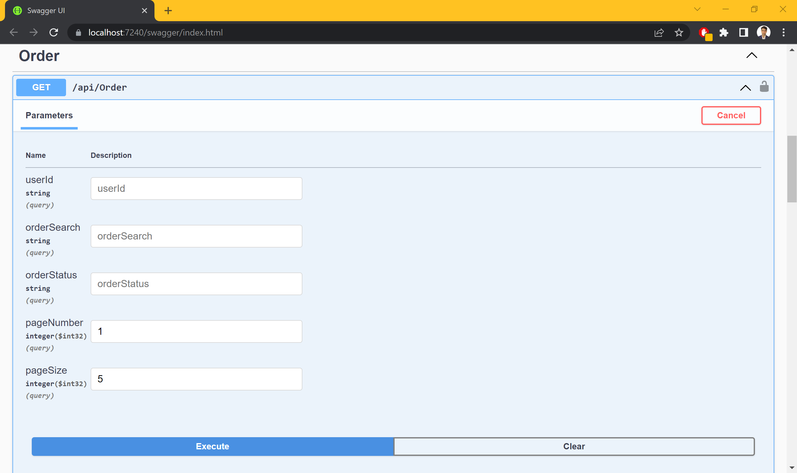
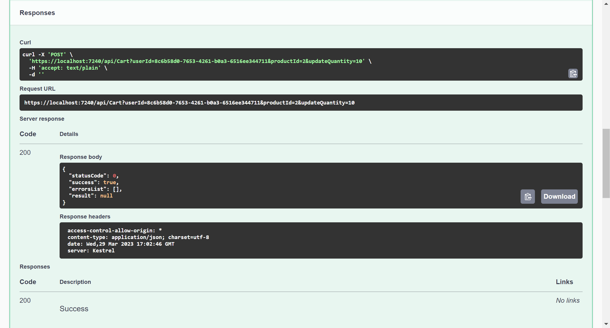
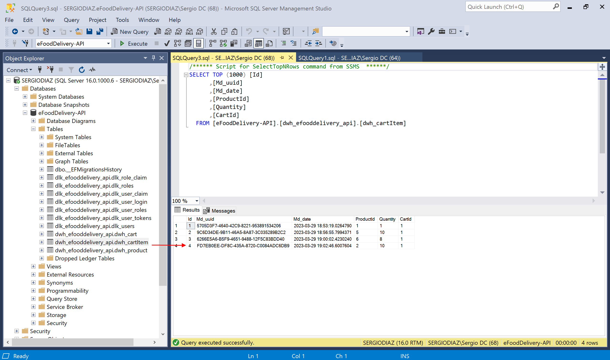
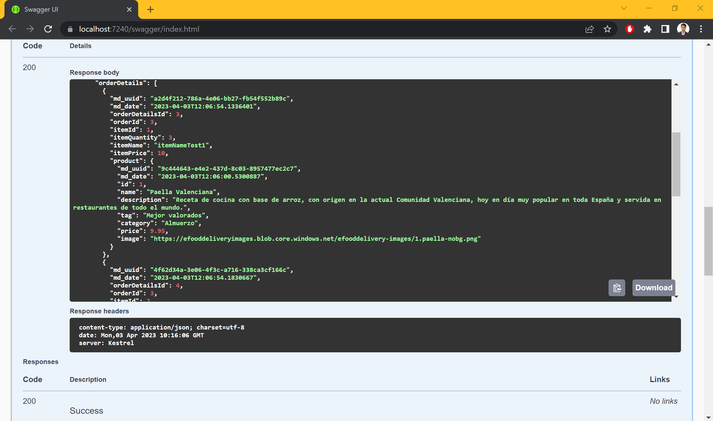
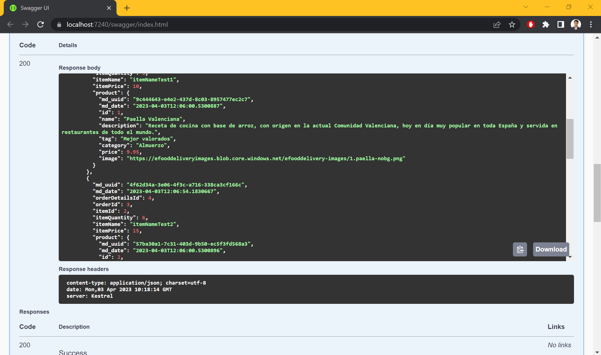
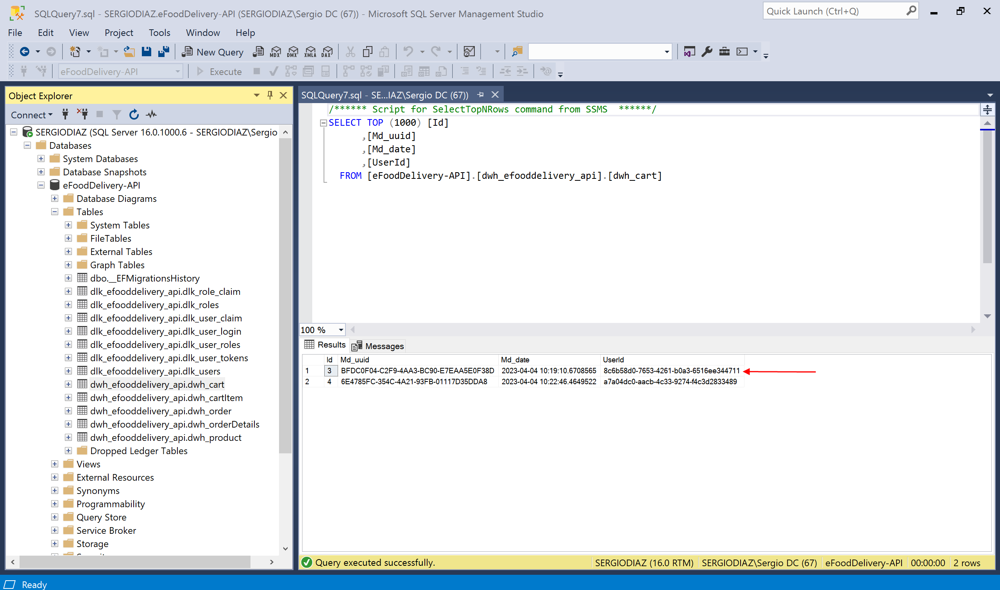
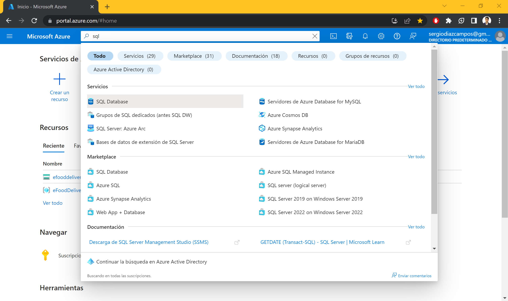
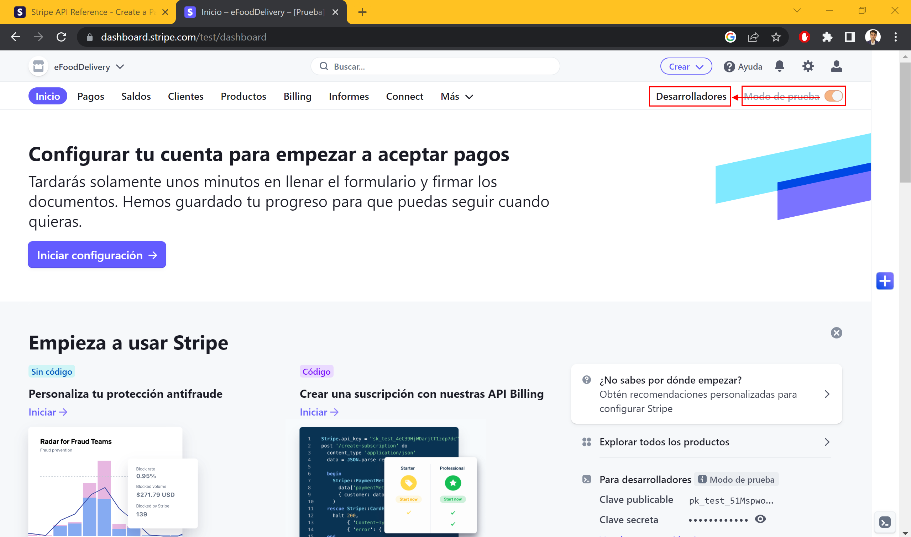

# eFoodDelivery Website - Trabajo de Fin de Grado

- [eFoodDelivery Website - Trabajo de Fin de Grado](#efooddelivery-website---trabajo-de-fin-de-grado)
  - [0.0 Crear el proyecto web API en Visual Studio 2022](#00-crear-el-proyecto-web-api-en-visual-studio-2022)
  - [0.1. Instalar los paquetes NuGets](#01-instalar-los-paquetes-nugets)
  - [0.2. Ejecución inicial de prueba](#02-ejecución-inicial-de-prueba)
- [1. Conexión con BBDD](#1-conexión-con-bbdd)
  - [1.1. Conexión con SqlServer](#11-conexión-con-sqlserver)
    - [1.1.1. Configurar la conexión con la BBDD](#111-configurar-la-conexión-con-la-bbdd)
    - [1.1.2. DbContexts --\> ApplicationDbContext.cs](#112-dbcontexts----applicationdbcontextcs)
    - [1.1.3. Añadir el servicio de conexión al Program.cs](#113-añadir-el-servicio-de-conexión-al-programcs)
    - [1.1.4. Realizamos la primera migración a BBDD](#114-realizamos-la-primera-migración-a-bbdd)
  - [1.2. Conexión con AzureSQL](#12-conexión-con-azuresql)
    - [1.2.1. Crear el server y la BBDD](#121-crear-el-server-y-la-bbdd)
    - [1.2.2. Nueva cadena de conexión](#122-nueva-cadena-de-conexión)
    - [1.2.3. ReMigramos las tablas de Identity](#123-remigramos-las-tablas-de-identity)
  - [1.3. Añadir campos a la tabla AspNetUsers y cambiar los nombres de las tablas](#13-añadir-campos-a-la-tabla-aspnetusers-y-cambiar-los-nombres-de-las-tablas)
    - [1.3.1. Models --\> ApplicationUser.cs](#131-models----applicationusercs)
    - [1.3.2. Actualizar el Program.cs](#132-actualizar-el-programcs)
    - [1.3.3. DbContexts --\> UserEntityConfiguration.cs](#133-dbcontexts----userentityconfigurationcs)
    - [1.3.4. DbContexts --\> ApplicationDbContext.cs](#134-dbcontexts----applicationdbcontextcs)
    - [1.3.5. Nueva migración](#135-nueva-migración)
    - [1.3.6. Cambiar los nombres por defecto de las tablas de Identity](#136-cambiar-los-nombres-por-defecto-de-las-tablas-de-identity)
  - [1.4. Product entity](#14-product-entity)
    - [1.4.1. Entities --\> Product.cs](#141-entities----productcs)
    - [1.4.2. DbContexts --\> sqlServerContext.cs](#142-dbcontexts----sqlservercontextcs)
    - [1.4.3. Creamos una nueva migración y pusheamos a la BBDD](#143-creamos-una-nueva-migración-y-pusheamos-a-la-bbdd)
  - [1.5 Añadir productos a la BBDD](#15-añadir-productos-a-la-bbdd)
    - [1.5.1. DbContexts --\> ApplicationDbContext.cs](#151-dbcontexts----applicationdbcontextcs)
    - [1.5.2. Nueva migración y a la pushear a la BBDD](#152-nueva-migración-y-a-la-pushear-a-la-bbdd)
- [2. Controlador del producto](#2-controlador-del-producto)
  - [2.1. GetProducts()](#21-getproducts)
    - [2.1.1. Models --\> ApiResponse.cs](#211-models----apiresponsecs)
  - [2.1.2. ProductController.cs --\> GetProducts()](#212-productcontrollercs----getproducts)
  - [2.1.3. Prueba de ejecución](#213-prueba-de-ejecución)
  - [2.2. GetProduct(int id)](#22-getproductint-id)
    - [2.2.1. ProductController.cs --\> GetProduct(int id)](#221-productcontrollercs----getproductint-id)
  - [2.2.2. Prueba de ejecución](#222-prueba-de-ejecución)
  - [2.3. Gestión de imágenes](#23-gestión-de-imágenes)
    - [2.3.1. Services --\> Interfaces --\> IBlobService.cs](#231-services----interfaces----iblobservicecs)
    - [2.3.2. Services --\> Implementations --\> BlobService.cs](#232-services----implementations----blobservicecs)
    - [2.3.3. appsettings.json](#233-appsettingsjson)
    - [2.3.4. Añadir los servicios Blob en el Program.cs](#234-añadir-los-servicios-blob-en-el-programcs)
    - [2.3.5. Desarrollo de los métodos de implementación del BlobService](#235-desarrollo-de-los-métodos-de-implementación-del-blobservice)
  - [2.4. CreateProduct(\[FromForm\] ProductCreateDTO productCreateDTO)](#24-createproductfromform-productcreatedto-productcreatedto)
    - [2.4.1. DTOs --\> ProductCreateDTO.cs](#241-dtos----productcreatedtocs)
    - [2.4.2. Tools --\> Constants.cs](#242-tools----constantscs)
    - [2.4.3. ProductController.cs --\> CreateProduct()](#243-productcontrollercs----createproduct)
    - [2.4.5. Modificando la etiqueta de la cabecera del método GetProduct()](#245-modificando-la-etiqueta-de-la-cabecera-del-método-getproduct)
    - [2.4.6. Prueba de ejecución](#246-prueba-de-ejecución)
  - [2.5. UpdateProduct(int id, \[FromForm\] ProductUpdateDTO productUpdateDTO)](#25-updateproductint-id-fromform-productupdatedto-productupdatedto)
    - [2.5.1. DTOs --\> ProductUpdateDTO.cs](#251-dtos----productupdatedtocs)
    - [2.5.2. ProductController.cs --\> UpdateProduct()](#252-productcontrollercs----updateproduct)
    - [2.5.3. Prueba de Ejecución](#253-prueba-de-ejecución)
  - [2.6. DeleteProduct(int id)](#26-deleteproductint-id)
    - [2.6.1. ProductController.cs --\> DeleteProduct()](#261-productcontrollercs----deleteproduct)
    - [2.6.2. Prueba de Ejecución](#262-prueba-de-ejecución)
- [3. Autentificación y Autorización](#3-autentificación-y-autorización)
  - [3.1. Login y Register DTOs](#31-login-y-register-dtos)
    - [3.1.1. DTOs --\> LoginRequestDTO.cs](#311-dtos----loginrequestdtocs)
    - [3.1.2. DTOs --\> LoginResponseDTO.cs](#312-dtos----loginresponsedtocs)
    - [3.1.3. DTOs --\> RegisterRequestDTO.cs](#313-dtos----registerrequestdtocs)
    - [3.1.4. Tools --\> Constants.cs](#314-tools----constantscs)
  - [3.2. Controllers --\> AuthenticationController.cs (Register)](#32-controllers----authenticationcontrollercs-register)
    - [3.2.1. Injección inicial de dependecias](#321-injección-inicial-de-dependecias)
    - [3.2.2. appsettings.json --\> JWTsecret](#322-appsettingsjson----jwtsecret)
    - [3.2.3. AuthenticationController.cs --\> Register(\[FromBody\] RegisterRequestDTO registerRequestDTO)](#323-authenticationcontrollercs----registerfrombody-registerrequestdto-registerrequestdto)
    - [3.2.4. Desactivar en el Program.cs durante el desarrollo del proyecto las comprobaciones de Identity en el registro](#324-desactivar-en-el-programcs-durante-el-desarrollo-del-proyecto-las-comprobaciones-de-identity-en-el-registro)
    - [3.2.5. Prueba de Ejecución](#325-prueba-de-ejecución)
  - [3.3. Login with JWT](#33-login-with-jwt)
    - [3.3.1. AuthenticationController.cs --\> Login()](#331-authenticationcontrollercs----login)
    - [3.3.2. appsettings.json --\> JWT string secret](#332-appsettingsjson----jwt-string-secret)
    - [3.3.3. Prueba de Ejecución](#333-prueba-de-ejecución)
  - [3.4. Usar el JWT para la Autentificación y la Autorización del usuario](#34-usar-el-jwt-para-la-autentificación-y-la-autorización-del-usuario)
    - [3.4.1. AuthenticationTestController.cs --\> GetAuthentication()](#341-authenticationtestcontrollercs----getauthentication)
    - [3.4.2. AuthenticationTestController.cs --\> GetAuthorization(int id)](#342-authenticationtestcontrollercs----getauthorizationint-id)
    - [3.4.3. Configurar la Autentificación en el Program.cs](#343-configurar-la-autentificación-en-el-programcs)
  - [3.5. Añadiendo seguridad a Swagger](#35-añadiendo-seguridad-a-swagger)
- [4. Cart y CartItem](#4-cart-y-cartitem)
  - [4.1. Entities --\> Cart.cs](#41-entities----cartcs)
  - [4.2. Entities --\> CartItem.cs](#42-entities----cartitemcs)
  - [4.3. DbContexts --\> ApplicationDbContext.cs](#43-dbcontexts----applicationdbcontextcs)
  - [4.4. Migrar a la BBDD las nuevas entidades](#44-migrar-a-la-bbdd-las-nuevas-entidades)
  - [4.5. Autogenerar un diagrama relacional de la BBDD](#45-autogenerar-un-diagrama-relacional-de-la-bbdd)
  - [4.6. Controllers --\> CartController.cs](#46-controllers----cartcontrollercs)
  - [4.7. CartController.cs --\> AddOrUpdateCartItem()](#47-cartcontrollercs----addorupdatecartitem)
  - [4.8. Pruebas de Ejecución del Carrito](#48-pruebas-de-ejecución-del-carrito)
  - [4.9. CartController.cs --\> GetCart()](#49-cartcontrollercs----getcart)
  - [4.10. Prueba de Ejecución de la obtención del Carrito](#410-prueba-de-ejecución-de-la-obtención-del-carrito)
- [5. Pedido](#5-pedido)
  - [5.1. Entities --\> Order.cs](#51-entities----ordercs)
  - [5.2. Entities --\> OrderDetails.cs](#52-entities----orderdetailscs)
  - [5.3. DbContexts --\> ApplicationDbContext.cs](#53-dbcontexts----applicationdbcontextcs)
  - [5.4. Hacemos una nueva migración para subir las nuevas entidades a la BBDD](#54-hacemos-una-nueva-migración-para-subir-las-nuevas-entidades-a-la-bbdd)
  - [5.5. Actualizamos nuestro diagrama de BBDD](#55-actualizamos-nuestro-diagrama-de-bbdd)
  - [5.6. OrderDTO y OrderDetailsDTO](#56-orderdto-y-orderdetailsdto)
    - [5.6.1. DTOs --\> OrderCreateDTO](#561-dtos----ordercreatedto)
    - [5.6.2. DTOs --\> OrderUpdateDTO](#562-dtos----orderupdatedto)
    - [5.6.3. DTOs --\> OrderDetailsCreateDTO](#563-dtos----orderdetailscreatedto)
  - [5.7. Controllers --\> OrderController.cs](#57-controllers----ordercontrollercs)
    - [5.7.1. OrderController.cs --\> GetOrders()](#571-ordercontrollercs----getorders)
    - [5.7.2. OrderController.cs --\> GetOrder()](#572-ordercontrollercs----getorder)
    - [5.7.3. OrderController.cs --\> CreateOrder()](#573-ordercontrollercs----createorder)
    - [5.7.4. Tools --\> Constants.cs](#574-tools----constantscs)
    - [5.7.5. OrderController.cs --\> UpdateOrder()](#575-ordercontrollercs----updateorder)
  - [5.8. Pruebas de Ejecución de los endpoints del Pedido](#58-pruebas-de-ejecución-de-los-endpoints-del-pedido)
    - [5.8.1. Prueba de crear un pedido](#581-prueba-de-crear-un-pedido)
    - [5.8.2. Prueba de obtener un pedido por su id](#582-prueba-de-obtener-un-pedido-por-su-id)
    - [5.8.3. Prueba de obtener todos los pedidos de un usuario](#583-prueba-de-obtener-todos-los-pedidos-de-un-usuario)
    - [5.8.4. Prueba de actualizar un pedido](#584-prueba-de-actualizar-un-pedido)
  - [5.9. Extra: Añadir filtrado de búsqueda y paginación a los pedidos](#59-extra-añadir-filtrado-de-búsqueda-y-paginación-a-los-pedidos)
    - [5.9.1. OrderController.cs --\> Añadir filtrado por búsqueda](#591-ordercontrollercs----añadir-filtrado-por-búsqueda)
    - [5.9.2. OrderController.cs --\> Añadir paginación](#592-ordercontrollercs----añadir-paginación)
- [6. Forma de Pago](#6-forma-de-pago)
  - [6.1. API Secret Key](#61-api-secret-key)
  - [6.2. appsettings.json](#62-appsettingsjson)
  - [6.3. Buscar e Instalar el paquete Nuget](#63-buscar-e-instalar-el-paquete-nuget)
  - [6.4. Controllers --\> PaymentController.cs](#64-controllers----paymentcontrollercs)
    - [6.4.1. PaymentController.cs --\> OrderPayment()](#641-paymentcontrollercs----orderpayment)
  - [6.5 Prueba de Ejecución](#65-prueba-de-ejecución)
- [7. Despliegue de la API en Azure](#7-despliegue-de-la-api-en-azure)
  - [7.1. Prueba de Ejecución en entorno de producción](#71-prueba-de-ejecución-en-entorno-de-producción)
- [Webgrafía y Enlaces de Interés](#webgrafía-y-enlaces-de-interés)
    - [1. Introduction to Identity on ASP.NET Core](#1-introduction-to-identity-on-aspnet-core)
    - [2. How can I change the table names when using ASP.NET Identity?](#2-how-can-i-change-the-table-names-when-using-aspnet-identity)
    - [3. Wrapping ASP.NET Web API Responses for consistency and to provide additional information](#3-wrapping-aspnet-web-api-responses-for-consistency-and-to-provide-additional-information)
    - [4. How to make your Web API responses consistent and useful](#4-how-to-make-your-web-api-responses-consistent-and-useful)
    - [5. How to use Azure Blob Storage in an ASP.NET Core Web API to list, upload, download, and delete files](#5-how-to-use-azure-blob-storage-in-an-aspnet-core-web-api-to-list-upload-download-and-delete-files)
    - [6. Almacenamiento de archivos mediante un API en .NET y Azure Blob Storage](#6-almacenamiento-de-archivos-mediante-un-api-en-net-y-azure-blob-storage)
    - [7. Web API in .NET 6.0 Tutorial: How to Build CRUD Operation](#7-web-api-in-net-60-tutorial-how-to-build-crud-operation)
    - [8. .NET 7 Web API \& Entity Framework - Full Course (CRUD, Repository Pattern, DI, SQL Server \& more)](#8-net-7-web-api--entity-framework---full-course-crud-repository-pattern-di-sql-server--more)
    - [9. .NET 7 Web API - Create JSON Web Tokens (JWT) - User Registration / Login /](#9-net-7-web-api---create-json-web-tokens-jwt---user-registration--login-)
    - [10. .NET 7 Web API - Role-Based Authorization with JSON Web Tokens (JWT) \& the dotnet user-jwts CLI](#10-net-7-web-api---role-based-authorization-with-json-web-tokens-jwt--the-dotnet-user-jwts-cli)
    - [11. Swagger Documentation --\> Bearer Authentication](#11-swagger-documentation----bearer-authentication)
    - [12. How To Add JWT Authentication To An ASP.NET Core API](#12-how-to-add-jwt-authentication-to-an-aspnet-core-api)
    - [13. How to Implement JWT Authentication in Asp.Net Core Web API](#13-how-to-implement-jwt-authentication-in-aspnet-core-web-api)
    - [14. Using Authorization with Swagger in ASP.NET Core](#14-using-authorization-with-swagger-in-aspnet-core)
    - [15. ASP.NET Core Swagger Documentation with Bearer Authentication](#15-aspnet-core-swagger-documentation-with-bearer-authentication)
    - [16. ShoppingCartService Explanation](#16-shoppingcartservice-explanation)
    - [17. ASP.NET Core Blazor: Creating Shopping Cart with EF and Web API](#17-aspnet-core-blazor-creating-shopping-cart-with-ef-and-web-api)
    - [18. Stripe API - Create a PaymentIntent object](#18-stripe-api---create-a-paymentintent-object)
    - [19. Accept a payment - Create a PaymentIntent with .NET](#19-accept-a-payment---create-a-paymentintent-with-net)
    - [20. Easily Deploy a .NET 7 API to Azure! \[2023 Tutorial\]](#20-easily-deploy-a-net-7-api-to-azure-2023-tutorial)
    - [21. Deploying the Web API to Azure with Dotnet command line: Field inventory management](#21-deploying-the-web-api-to-azure-with-dotnet-command-line-field-inventory-management)
  - [Inteligencias Artificiales usadas como ayuda y orientación](#inteligencias-artificiales-usadas-como-ayuda-y-orientación)
    - [1. OpenAI --\> ChatGPT](#1-openai----chatgpt)
    - [2. Visual Studio Extension --\> GitHub Copilot](#2-visual-studio-extension----github-copilot)
- [Pruebas de Ejecución](#pruebas-de-ejecución)
  - [ProductController.cs --\> GetProducts()](#productcontrollercs----getproducts)
  - [ProductController.cs --\> GetProduct(int id)](#productcontrollercs----getproductint-id)
  - [ProductController.cs --\> CreateProduct(\[FromForm\] ProductCreateDTO productCreateDTO)](#productcontrollercs----createproductfromform-productcreatedto-productcreatedto)
  - [ProductController.cs --\> UpdateProduct(int id, \[FromForm\] ProductUpdateDTO productUpdateDTO)](#productcontrollercs----updateproductint-id-fromform-productupdatedto-productupdatedto)
  - [ProductController.cs --\> DeleteProduct(int id)](#productcontrollercs----deleteproductint-id)
  - [AuthenticationController.cs --\> Register(\[FromBody\] RegisterRequestDTO registerRequestDTO)](#authenticationcontrollercs----registerfrombody-registerrequestdto-registerrequestdto)
  - [AuthenticationController.cs --\> Login(\[FromBody\] LoginRequestDTO loginRequestDTO)](#authenticationcontrollercs----loginfrombody-loginrequestdto-loginrequestdto)
  - [CartController.cs --\> AddOrUpdateCartItem(string userId, int productId, int updateQuantity)](#cartcontrollercs----addorupdatecartitemstring-userid-int-productid-int-updatequantity)
    - [Crear un carrito](#crear-un-carrito)
    - [Añadir o quitar productos(items) del carrito](#añadir-o-quitar-productositems-del-carrito)
    - [Crear un carrito con otro usuario](#crear-un-carrito-con-otro-usuario)
  - [CartController.cs --\> GetCart(string userId)](#cartcontrollercs----getcartstring-userid)
  - [OrderController.cs --\> CreateOrder(\[FromBody\] OrderCreateDTO orderCreateDTO)](#ordercontrollercs----createorderfrombody-ordercreatedto-ordercreatedto)
  - [OrderController.cs --\> GetOrder(int orderId)](#ordercontrollercs----getorderint-orderid)
  - [OrderController.cs --\> GetOrders(string? userId)](#ordercontrollercs----getordersstring-userid)
  - [OrderController.cs --\> UpdateOrder(int orderId, \[FromBody\] OrderUpdateDTO orderUpdateDTO)](#ordercontrollercs----updateorderint-orderid-frombody-orderupdatedto-orderupdatedto)
  - [PaymentController.cs --\> OrderPayment(string userId)](#paymentcontrollercs----orderpaymentstring-userid)
- [Extras](#extras)
  - [1. Crear la BBDD en Azure](#1-crear-la-bbdd-en-azure)
  - [2. Crear el Azure Storage para nuestras imágenes](#2-crear-el-azure-storage-para-nuestras-imágenes)
  - [3. Cambiar los nombres por defecto de las tablas de Identity](#3-cambiar-los-nombres-por-defecto-de-las-tablas-de-identity)
    - [DbContexts --\> UserEntityConfiguration.cs](#dbcontexts----userentityconfigurationcs)
    - [DbContexts --\> ApplicationDbContext.cs](#dbcontexts----applicationdbcontextcs)
    - [Creamos una nueva migración y la pusheamos a la BBDD](#creamos-una-nueva-migración-y-la-pusheamos-a-la-bbdd)
  - [4. Obtener una nueva Clave Secreta API en Stripe](#4-obtener-una-nueva-clave-secreta-api-en-stripe)
  - [5. Enlace al espacio de trabajo y al tablero del proyecto en Trello](#5-enlace-al-espacio-de-trabajo-y-al-tablero-del-proyecto-en-trello)
  - [6. Diagrama de Gantt del proyecto API](#6-diagrama-de-gantt-del-proyecto-api)


## 0.0 Crear el proyecto web API en Visual Studio 2022


## 0.1. Instalar los paquetes NuGets

- Microsoft.AspNetCore.Authentication.JwtBearer
- Microsoft.AspNetCore.Identity.EntityFrameworkCore
- Microsoft.EntityFrameworkCore.Tools
- Microsoft.EntityFrameworkCore.SqlServer
- Azure.Storage.Blobs

## 0.2. Ejecución inicial de prueba


# 1. Conexión con BBDD

## 1.1. Conexión con SqlServer

<!-- 
### 1.1.0. Diagrama Relacional Inicial de la BBDD

 
-->

### 1.1.1. Configurar la conexión con la BBDD

Para ello vamos al *appsettings.json* y añadimos nuestro *ConnectionStrings*

```json
"ConnectionStrings": {
    "SqlServerConnection": "Server=.;Database=eFoodDelivery-API;TrustServerCertificate=True;Trusted_Connection=True;"
  }
```

### 1.1.2. DbContexts --> ApplicationDbContext.cs

Creamos una nueva carpeta para albergar nuestros DbContexts, y creamos la clase de nuestra conexión a SqlServer

```csharp
public class ApplicationDbContext : IdentityDbContext
{
    public ApplicationDbContext(DbContextOptions options) : base(options)
    {
    }
}
```

### 1.1.3. Añadir el servicio de conexión al Program.cs

```csharp
// Add services to the container.
builder.Services.AddDbContext<ApplicationDbContext>(options =>
{
    options.UseSqlServer(builder.Configuration.GetConnectionString("SqlServerConnection"));
});

builder.Services.AddIdentity<IdentityUser, IdentityRole>().AddEntityFrameworkStores<ApplicationDbContext>();
```

### 1.1.4. Realizamos la primera migración a BBDD

Abrimos la consola de paquetes NuGets para ejecutar los siguientes comandos:

```bash
Add-Migration m1-identity -Context ApplicationDbContext
```

Este comando nos genera dos archivos, y en el principal de ellos, EntityFramework nos ha creado un script sql para la creación de las tablas de Identity, las cuales engloban todo lo relacionado con la gestión de los usuarios de nuestra web, facilitándonos sobretodo el login, register y roles.

| AspNetRoleClaims |
--- |
| Id, RoleId, ClaimType, ClaimValue |

| AspNetRoles |
--- |
| Id, Name, NormalizedName, ConcurrencyStamp |

| AspNetUserClaims |
--- |
| Id, UserId, ClaimType, ClaimValue |

| AspNetUserLogins |
--- |
| LoginProvider, ProviderKey, ProviderDisplayName, UserId |

| AspNetUserRoles |
--- |
| UserId, RoleId |

| AspNetUserTokens |
--- |
| Id, LoginProvider, Name, Value |

| AspNetUsers |
--- |
| Id, UserName, NormalizedUserName, Email, NormalizedEmail, EmailConfirmed, PasswordHash, SecurityStamp, ConcurrencyStamp, PhoneNumber, PhoneNumberConfirmed, TwoFactorEnabled, LockoutEnd, LockoutEnabled, AccessFailedCount |

El segundo comando que vamos a ejecutar es para que EntityFramework nos cree la BBDD y sus correspondientes tablas en nuestro SqlServer

```bash
Update-Database -Context ApplicationDbContext
```


## 1.2. Conexión con AzureSQL

### 1.2.1. Crear el server y la BBDD

[crear la bbdd en azure](#crear-la-bbdd-en-azure)

### 1.2.2. Nueva cadena de conexión

Añadimos el string de la conexión alternativa a nuestra BBDD en Azure

```json
"ConnectionStrings": {
    // "SqlServerConnection": "Server=.;Database=eFoodDelivery-API;TrustServerCertificate=True;Trusted_Connection=True;",
    "AzureDbConnection": "Server=tcp:efooddelivery-db.database.windows.net,1433;Initial Catalog=eFoodDelivery-API;Persist Security Info=False;User ID=sqladmin;Password=YourPassword;MultipleActiveResultSets=False;Encrypt=True;TrustServerCertificate=False;Connection Timeout=30;"
  }
```

**Nota:** para migrar también a esta BBDD alternativa en Azure, comentamos en el *appsettings.json* la sentencia de conexión con SqlServer (sin olvidar cambiar el identificador de esta nueva conexión en el Program.cs).

### 1.2.3. ReMigramos las tablas de Identity

```bash
Update-Database -Context ApplicationDbContext
```


**Nota:** por el momento, mantendremos comentada la sentencia de la conexión alternativa a la BBDD de Azure, para continuar trabajando con la BBDD de SqlServer en local.

## 1.3. Añadir campos a la tabla AspNetUsers y cambiar los nombres de las tablas

### 1.3.1. Models --> ApplicationUser.cs

Los campos que trae por defecto la tabla del usuario de Identity son limitados, y si queremos añadir más campos, como por ejemplo, un *username*, tenemos que crear nuestra propia clase de usuario la cual hereda de *IdentityUser*

```csharp
public class ApplicationUser : IdentityUser
{
    public string Name { get; set; }
}
```

### 1.3.2. Actualizar el Program.cs

```csharp
// Add Identity
builder.Services.AddIdentity<ApplicationUser, IdentityRole>().AddEntityFrameworkStores<ApplicationDbContext>();
```

### 1.3.3. DbContexts --> UserEntityConfiguration.cs

```csharp
public class UserEntityConfiguration : IEntityTypeConfiguration<ApplicationUser>
{
    public void Configure(EntityTypeBuilder<ApplicationUser> builder)
    {
        builder.Property(user => user.Name).HasMaxLength(20);
    }
}
```

### 1.3.4. DbContexts --> ApplicationDbContext.cs

Especificamos a EntityFramework la nueva clase del usuario

```csharp
public class ApplicationDbContext : IdentityDbContext<ApplicationUser>
{
    public ApplicationDbContext(DbContextOptions options) : base(options)
    {
    }

    public DbSet<ApplicationUser> ApplicationUsersDbSet { get; set; }

    protected override void OnModelCreating(ModelBuilder builder)
    {
        base.OnModelCreating(builder);
        builder.ApplyConfiguration(new UserEntityConfiguration());
        builder.HasDefaultSchema("dlk_efooddelivery_api");
    }
}
```

### 1.3.5. Nueva migración

Creamos una nueva migración y la pusheamos a nuestra BBDD local, y efectivamente comprobamos que ya tenemos el nuevo campos del *name* del usuario.


### 1.3.6. Cambiar los nombres por defecto de las tablas de Identity

[Cambiar los nombres por defecto de las tablas de Identity](#cambiar-los-nombres-por-defecto-de-las-tablas-de-identity)

```csharp
public class ApplicationDbContext : IdentityDbContext<ApplicationUser>
{
    ...
    // overrriding the OnModelCreating() method for customize our entities (tables)
    protected override void OnModelCreating(ModelBuilder builder)
    {
        ...
        builder.Entity<ApplicationUser>().ToTable("dlk_users");
        builder.Entity<IdentityRole>().ToTable("dlk_roles");
        builder.Entity<IdentityUserRole<string>>().ToTable("dlk_user_roles");
        builder.Entity<IdentityRoleClaim<string>>().ToTable("dlk_role_claim");
        builder.Entity<IdentityUserClaim<string>>().ToTable("dlk_user_claim");
        builder.Entity<IdentityUserLogin<string>>().ToTable("dlk_user_login");
        builder.Entity<IdentityUserToken<string>>().ToTable("dlk_user_tokens");
    }
}
```

## 1.4. Product entity

### 1.4.1. Entities --> Product.cs

Vamos a crear nuestra primera entidad, la del Producto.

```csharp
[Table("product", Schema = "dwh_efooddelivery_api")]
public class Product
{
    [Column("Md_uuid")]
    [Display(Name = "Md_uuid")]
    [DatabaseGenerated(DatabaseGeneratedOption.Identity)]
    public Guid Md_uuid { get; set; } = Guid.NewGuid();

    [Column("Md_date")]
    [Display(Name = "Md_date")]
    [DataType(DataType.DateTime)]
    [DisplayFormat(DataFormatString = "{0:dd-MM-yyyy}", ApplyFormatInEditMode = true)]
    public DateTime Md_date { get; set; } = DateTime.Now;

    [Key]
    [Column("Id")]
    [Display(Name = "Id")]
    [DatabaseGenerated(DatabaseGeneratedOption.Identity)]
    public int Id { get; set; }

    [Required]
    [Column("Name")]
    [Display(Name = "Name")]
    [StringLength(30, ErrorMessage = "El nombre del producto no puede exceder los 30 caracteres")]
    public string Name { get; set; }

    [Column("Description")]
    [Display(Name = "Description")]
    [StringLength(250, ErrorMessage = "La descripción del producto no puede exceder los 250 caracteres")]
    public string Description { get; set; }

    [Column("Tag")]
    [Display(Name = "Tag")]
    [StringLength(20, ErrorMessage = "La etiqueta del producto no puede exceder los 20 caracteres")]
    public string Tag { get; set; }

    [Column("Category")]
    [Display(Name = "Category")]
    [StringLength(20, ErrorMessage = "La categoría del producto no puede exceder los 20 caracteres")]
    public string Category { get; set; }

    [Column("Price")]
    [Display(Name = "Price")]
    [Range(1, 99, ErrorMessage = "El precio del producto no puede ser mayor a 99,00€")]
    public double Price { get; set; }

    [Required]
    [Column("Image")]
    [Display(Name = "Image")]
    public string Image { get; set; }
}
```

### 1.4.2. DbContexts --> sqlServerContext.cs

Añadimos el DbSet de la entiddad *Product*

```csharp
...
// navigation properties for entities (also it creates the tables)
public DbSet<ApplicationUser> ApplicationUsersDbSet { get; set; }
public DbSet<Product> ProductsDbSet { get; set; }
...
```

### 1.4.3. Creamos una nueva migración y pusheamos a la BBDD

```bash
Add-Migration m2-product -Context ApplicationDbContext
```

```bash
Update-Database -Context ApplicationDbContext
```


## 1.5 Añadir productos a la BBDD

Para poder testear bien las siguientes funcionalidades propias de un CRUD que desarrollaré en los siguientes apartados, necesito algunos productos de prueba y de base con los que empezar, y para ello usaré un objeto del tipo ModelBuilder en el contexto, para realizar algunos insert de productos en una nueva migración.

### 1.5.1. DbContexts --> ApplicationDbContext.cs

Siguiendo con el método del OnModelCreating(ModelBuilder) ...

```csharp
builder.Entity<Product>().HasData(
    // vamos añadiendo productos de ejemplo aquí
    new Product
    {
        Md_uuid = Guid.NewGuid(),
        Md_date = DateTime.Now,
        Id = 1,
        Name = "Paella Valenciana",
        Description = "Receta de cocina con base de arroz, con origen en la actual Comunidad Valenciana, hoy en día muy popular en toda España y servida en restaurantes de todo el mundo.​",
        Tag = "Mejor valorados",
        Category = "Almuerzo",
        Price = 9.95,
        Image = "https://efooddeliveryimages.blob.core.windows.net/efooddelivery-images/1.paella-nobg.png"
    },
    ...
);
```

### 1.5.2. Nueva migración y a la pushear a la BBDD

```bash
Add-Migration m3-sd-product -Context ApplicationDbContext
```

```bash
Update-Database -Context SqlSeerverContext
```


# 2. Controlador del producto

Creamos un controlador API para la entidad del Producto para desarrollar su CRUD.

## 2.1. GetProducts()

### 2.1.1. Models --> ApiResponse.cs

Necesitamos un modelo de lo que sería la respuesta de la petición get al servidor, la cual podremos controlar mejor si declaramos algunas propiedades para después utilizarlas en el controlador del producto.

```csharp
public class ApiResponse
{
    public HttpStatusCode StatusCode { get; set; } // eg: 404
    public bool Success { get; set; } // true or false
    public List<string> ErrorsList { get; set; } // eg: "there's no products avaible right now"
    public object Result { get; set; } // object fetched
    
    public ApiResponse() 
    {
        ErrorsList = new List<string>();
    }
}
```

## 2.1.2. ProductController.cs --> GetProducts()

```csharp
// [Route("api/[controller]")] // instead a dynamic route, if I change the controller name, the route does not get updated
[Route("api/Product")]
[ApiController]
public class ProductController : ControllerBase
{
    private readonly ApplicationDbContext _dbContext; // read property for our context
    private ApiResponse _apiResponse; // property for our API response

    public ProductController(ApplicationDbContext dbContext) // dependency injection
    {
        _dbContext = dbContext;
        _apiResponse = new ApiResponse();
    }

    [HttpGet]
    public async Task<IActionResult> GetProducts()
    {
        // return Ok(_dbContext.ProductsDbSet); // it will go to DB and fetch all products and return back, but I want to get better control for api response

        _apiResponse.Result = _dbContext.ProductsDbSet;
        _apiResponse.StatusCode = HttpStatusCode.OK;
        return Ok(_apiResponse);
    }
}
```

## 2.1.3. Prueba de ejecución

Ejecutamos el proyecto, y en Swagger, le damos al GET del endpoint de nuestro producto, y confirmamos que obtenemos todos los productos de prueba que previamente insertamos en la BBDD.

[Prueba de ejecución del método GetProducts()](#productcontrollercs----getproducts)

## 2.2. GetProduct(int id)

### 2.2.1. ProductController.cs --> GetProduct(int id)

```csharp
[HttpGet("{id:int}")] // like this method has a parameter, I need to specify what parameter is (name:type)
public async Task<IActionResult> GetProduct(int id)
{
    if (id == 0) // check for BadRequest
    {
        _apiResponse.StatusCode = HttpStatusCode.BadRequest;
        _apiResponse.Success = false;
        return BadRequest(_apiResponse);
    }
            
    Product product = _dbContext.ProductsDbSet.FirstOrDefault(p => p.Id == id);
            
    if(product == null) // check for NotFound
    {
        _apiResponse.StatusCode = HttpStatusCode.NotFound;
        _apiResponse.Success = false;
        return NotFound(_apiResponse);
    }

    _apiResponse.Result = product;
    _apiResponse.StatusCode = HttpStatusCode.OK;
    return Ok(_apiResponse);
}
```

## 2.2.2. Prueba de ejecución

[Prueba de ejecución del método GetProduct(int id)](#productcontrollercs----getproductint-id)

## 2.3. Gestión de imágenes

Antes de seguir con el CRUD del Producto (create, update y delete), necesitamos implementar el tratamiento de las imágenes de los productos.

**Nota:** aquí es donde voy a usar el paquete NuGet de Azure.Storage.Blob

### 2.3.1. Services --> Interfaces --> IBlobService.cs

```csharp
public interface IBlobService
{
    Task<string> GetBlob(string blobName, string containerName);

    Task<string> UploadBlob(string blobName, string containerName, IFormFile file);
        
    Task<bool> DeleteBlob(string blobName, string containerName);
}
```

### 2.3.2. Services --> Implementations --> BlobService.cs

```csharp
public class BlobService : IBlobService
{
    public Task<string> GetBlob(string blobName, string containerName)
    {
        throw new NotImplementedException();
    }

    public Task<string> UploadBlob(string blobName, string containerName, IFormFile file)
    {
        throw new NotImplementedException();
    }

    public Task<bool> DeleteBlob(string blobName, string containerName)
    {
        throw new NotImplementedException();
    }
}
```

### 2.3.3. appsettings.json

Aquí tenemos que añadir un nuevo string de conexión, el cual necesito sacarlo de AzureStorage donde ya había creado antes mi contenedor de imágenes y había subido las mismas.


```json
"ConnectionStrings": {
    ...
    "AzureImagesStorage": "TuCadenaDeConexión"
}
```

### 2.3.4. Añadir los servicios Blob en el Program.cs

```csharp
...
// activate Azure.Storage.Blobs nuget package
builder.Services.AddSingleton(blobService => // Singleton means there will only be one object when the application starts
    new BlobServiceClient(
        builder.Configuration.GetConnectionString("AzureImagesStorage")        
    )
);
builder.Services.AddSingleton<IBlobService, BlobService>();
...
```

### 2.3.5. Desarrollo de los métodos de implementación del BlobService

```csharp
public class BlobService : IBlobService
{
    private readonly BlobServiceClient _blobServiceClient;

    public BlobService(BlobServiceClient blobServiceClient)
    {
        _blobServiceClient = blobServiceClient;
    }

    public async Task<string> GetBlob(string blobName, string containerName)
    {
        // we have to get the container client, because in Azure we can have multiple containers for storage images
        BlobContainerClient blobContainerClient = _blobServiceClient.GetBlobContainerClient(containerName);
        // find blob (image) by blobName (imageName)
        BlobClient blobClient = blobContainerClient.GetBlobClient(blobName);

        // return full route for the blob (image)
        return blobClient.Uri.AbsoluteUri;
    }

    public async Task<string> UploadBlob(string blobName, string containerName, IFormFile file)
    {
        // we have to get the container client, because in Azure we can have multiple containers for storage images
        BlobContainerClient blobContainerClient = _blobServiceClient.GetBlobContainerClient(containerName);
        // find blob (image) by blobName (imageName)
        BlobClient blobClient = blobContainerClient.GetBlobClient(blobName);

        // we can also define blob HTTP header and set the content type
        var httpHeaders = new BlobHttpHeaders()
        {
            ContentType = file.ContentType
        };

        // upload the blob (image)
        var result = await blobClient.UploadAsync(file.OpenReadStream(), httpHeaders);

        if (result != null) // to get the blob updated
            return await GetBlob(blobName, containerName);

        // if (result == null)
            return "";
    }

    public async Task<bool> DeleteBlob(string blobName, string containerName)
    {
        // we have to get the container client, because in Azure we can have multiple containers for storage images
        BlobContainerClient blobContainerClient = _blobServiceClient.GetBlobContainerClient(containerName);
        // find blob (image) by blobName (imageName)
        BlobClient blobClient = blobContainerClient.GetBlobClient(blobName);

        return await blobClient.DeleteIfExistsAsync();
    }
}
```

## 2.4. CreateProduct([FromForm] ProductCreateDTO productCreateDTO)

### 2.4.1. DTOs --> ProductCreateDTO.cs

```csharp
public class ProductCreateDTO
{
    [Required]
    [StringLength(30, ErrorMessage = "El nombre del producto no puede exceder los 30 caracteres")]
    public string Name { get; set; }

    [StringLength(250, ErrorMessage = "La descripción del producto no puede exceder los 250 caracteres")]
    public string Description { get; set; }

    [StringLength(20, ErrorMessage = "La etiqueta del producto no puede exceder los 20 caracteres")]
    public string Tag { get; set; }

    [StringLength(20, ErrorMessage = "La categoría del producto no puede exceder los 20 caracteres")]
    public string Category { get; set; }

    [Range(1, 99, ErrorMessage = "El precio del producto no puede ser mayor a 99,00€")]
    public double Price { get; set; }

    public IFormFile Image { get; set; }
}
```

### 2.4.2. Tools --> Constants.cs

Como necesito declarar en alguna parte el nombre de mi contenedor de imágenes en Azure, voy a crear esta clase la cual me seguirá sirviendo para el restod e constantes que vaya necesitando declarar.

```csharp
public static class Constants
{
    public const string SD_STORAGE_CONTAINER = "efooddelivery-images";
}
```

### 2.4.3. ProductController.cs --> CreateProduct()

```csharp
[HttpPost]
public async Task<ActionResult<ApiResponse>> CreateProduct([FromForm] ProductCreateDTO productCreateDTO) // I'm not using [FromBody] and I'm using [FromForm] bacause we also need to upload an image when we creating a product
{
    try
    {
        if (ModelState.IsValid) // like we have some required fields, it will validate if all the endpoints are valid
        {
            if (productCreateDTO.Image == null || productCreateDTO.Image.Length == 0)
            {
                _apiResponse.StatusCode = HttpStatusCode.BadRequest;
                _apiResponse.Success = false;
                return BadRequest();
            }
                

            // get the imageName = name + .extension
            string imageName = $"{Guid.NewGuid()}{Path.GetExtension(productCreateDTO.Image.FileName)}";

            // create the new Product object through its dto
            Product productToCreate = new Product();
            productToCreate.Name = productCreateDTO.Name;
            productToCreate.Description = productCreateDTO.Description;
            productToCreate.Tag = productCreateDTO.Tag;
            productToCreate.Category = productCreateDTO.Category;
            productToCreate.Price = productCreateDTO.Price;
            productToCreate.Image = await _blobService.UploadBlob(imageName, Constants.SD_STORAGE_CONTAINER, productCreateDTO.Image); // upload the blob and it will return back the URL which we will save in the image
                    
            // save the object in DB
            _dbContext.ProductsDbSet.Add(productToCreate);
            _dbContext.SaveChanges();
            _apiResponse.Result = productToCreate;
            _apiResponse.StatusCode = HttpStatusCode.Created;
                    
            // return go to GetProduct() method to view the new product created
            return CreatedAtRoute("GetProduct", new { id = productToCreate.Id }, _apiResponse);
        }
        else
            _apiResponse.Success = false;

    } catch (Exception ex)
    {
        _apiResponse.Success = false;
        _apiResponse.ErrorsList = new List<string>() { ex.ToString() };
    }

    return _apiResponse;
}
```

### 2.4.5. Modificando la etiqueta de la cabecera del método GetProduct()

```csharp
[HttpGet("{id:int}", Name = "GetProduct")] // like this method has a parameter, I need to specify what parameter is (name:type) // also specify a Name for the action method in CreateProduct()
public async Task<IActionResult> GetProduct(int id) 
{
    ...
}
```

### 2.4.6. Prueba de ejecución

[Prueba de ejecución del método CreateProduct([FromForm] ProductCreateDTO productCreateDTO)](#productcontrollercs----createproductfromform-productcreatedto-productcreatedto)

## 2.5. UpdateProduct(int id, [FromForm] ProductUpdateDTO productUpdateDTO)

### 2.5.1. DTOs --> ProductUpdateDTO.cs

```csharp
public class ProductUpdateDTO
{
    [Key]
    public int Id { get; set; }

    [Required]
    [StringLength(30, ErrorMessage = "El nombre del producto no puede exceder los 30 caracteres")]
    public string Name { get; set; }

    [StringLength(250, ErrorMessage = "La descripción del producto no puede exceder los 250 caracteres")]
    public string Description { get; set; }

    [StringLength(20, ErrorMessage = "La etiqueta del producto no puede exceder los 20 caracteres")]
    public string Tag { get; set; }

    [StringLength(20, ErrorMessage = "La categoría del producto no puede exceder los 20 caracteres")]
    public string Category { get; set; }

    [Range(1, 99, ErrorMessage = "El precio del producto no puede ser mayor a 99,00€")]
    public double Price { get; set; }

    public IFormFile Image { get; set; }
}
```

### 2.5.2. ProductController.cs --> UpdateProduct()

```csharp
[HttpPut("{id:int}")]
public async Task<ActionResult<ApiResponse>> UpdateProduct(int id, [FromForm] ProductUpdateDTO productUpdateDTO) // I'm not using [FromBody] and I'm using [FromForm] bacause we also need to upload an image when we creating a product
{
    try
    {
        if (ModelState.IsValid) // like we have some required fields, it will validate if all the endpoints are valid
        {
            if (productUpdateDTO == null || id != productUpdateDTO.Id) return BadRequest();

            // Product productRetrievedFromDb = await _dbContext.ProductsDbSet.FirstOrDefaultAsync(p => p.Id == id);
            Product productRetrievedFromDb = await _dbContext.ProductsDbSet.FindAsync(id); // FindAsync() search by PK and in this case it works

            if (productRetrievedFromDb == null) 
            {
                _apiResponse.StatusCode = HttpStatusCode.BadRequest;
                _apiResponse.Success = false;
                return BadRequest();
            }

            productRetrievedFromDb.Name = productUpdateDTO.Name;
            productRetrievedFromDb.Description = productUpdateDTO.Description;
            productRetrievedFromDb.Tag = productUpdateDTO.Tag;
            productRetrievedFromDb.Category = productUpdateDTO.Category;
            productRetrievedFromDb.Price = productUpdateDTO.Price;

            if (productUpdateDTO.Image != null && productUpdateDTO.Image.Length > 0)
            {
                // get the imageName = name + .extension
                string imageName = $"{Guid.NewGuid()}{Path.GetExtension(productUpdateDTO.Image.FileName)}";

                // first, we need to delete the old image, and we have to get it with the URL after the second slash
                // https://efooddeliveryimages.blob.core.windows.net/efooddelivery-images/6622221b-7bf8-4204-9fb8-8e96d4e6490c.jpg  
                await _blobService.DeleteBlob(productRetrievedFromDb.Image.Split('/').Last(), Constants.SD_STORAGE_CONTAINER);
                        
                // second, upload the new product
                productRetrievedFromDb.Image = await _blobService.UploadBlob(imageName, Constants.SD_STORAGE_CONTAINER, productUpdateDTO.Image); // upload the blob and it will return back the URL which we will save in the image
            }

            // update the object in DB
            _dbContext.ProductsDbSet.Update(productRetrievedFromDb);
            _dbContext.SaveChanges();
            _apiResponse.StatusCode = HttpStatusCode.NoContent;

            return Ok(_apiResponse);
        }
        else _apiResponse.Success = false;

    }
    catch (Exception ex)
    {
        _apiResponse.Success = false;
        _apiResponse.ErrorsList = new List<string>() { ex.ToString() };
    }

    return _apiResponse;
}
```

### 2.5.3. Prueba de Ejecución

[Prueba de ejecución del método UpdateProduct(int id, [FromForm] ProductUpdateDTO productUpdateDTO)](#productcontrollercs----updateproductint-id-fromform-productupdatedto-productupdatedto)

## 2.6. DeleteProduct(int id)

### 2.6.1. ProductController.cs --> DeleteProduct()

```csharp
[HttpDelete("{id:int}")]
public async Task<ActionResult<ApiResponse>> DeleteProduct(int id)
{
    try
    {
        if (id == 0) 
        {
            _apiResponse.StatusCode = HttpStatusCode.BadRequest;
            _apiResponse.Success = false;
            return BadRequest();
        }

        // Product productRetrievedFromDb = await _dbContext.ProductsDbSet.FirstOrDefaultAsync(p => p.Id == id);
        Product productRetrievedFromDb = await _dbContext.ProductsDbSet.FindAsync(id); // FindAsync() search by PK and in this case it works

        if (productRetrievedFromDb == null) 
        {
            _apiResponse.StatusCode = HttpStatusCode.BadRequest;
            _apiResponse.Success = false;
            return BadRequest();
        }
        
        // first, we need to delete the old image, and we have to get it with the URL after the second slash
        // https://efooddeliveryimages.blob.core.windows.net/efooddelivery-images/6622221b-7bf8-4204-9fb8-8e96d4e6490c.jpg
        await _blobService.DeleteBlob(productRetrievedFromDb.Image.Split('/').Last(), Constants.SD_STORAGE_CONTAINER);
                
        // remove the object in DB
        _dbContext.ProductsDbSet.Remove(productRetrievedFromDb);
        _dbContext.SaveChanges();
        _apiResponse.StatusCode = HttpStatusCode.NoContent;

        return Ok(_apiResponse);

    }
    catch (Exception ex)
    {
        _apiResponse.Success = false;
        _apiResponse.ErrorsList = new List<string>() { ex.ToString() };
    }

    return _apiResponse;
}
```

### 2.6.2. Prueba de Ejecución

[Prueba de ejecución del método DeleteProduct(int id)](#productcontrollercs----deleteproductint-id)

# 3. Autentificación y Autorización

## 3.1. Login y Register DTOs

Vamos a comenzar por la creación de los DTOs para el Login. 
Crearemos un DTO para la petición del Login, y otro para la respuesta de éste.

### 3.1.1. DTOs --> LoginRequestDTO.cs

```csharp
public class LoginRequestDTO
{
    public string UserName { get; set; }
    public string Password { get; set; }
}
```

### 3.1.2. DTOs --> LoginResponseDTO.cs

```csharp
public class LoginResponseDTO
{
    public string Email { get; set; }
    public string Token { get; set; } // in this string Token we can add whatever details we want, like email, userID, userRole and more
}
```

### 3.1.3. DTOs --> RegisterRequestDTO.cs

```csharp
public class RegisterRequestDTO
{
    public string UserName { get; set; }
    public string Name { get; set; }
    public string Password { get; set; }
    public string Role { get; set; } 
    // if we want to create a user with admin role, we will expect that as a string when a user is registering
    // but I know role should not be in the registration in the production API
    // then, I will find out some other way to register the admin user like by seeding the database
}
```

En el caso del Register, no necesitamos otro modelo para la respuesta, porque si el resgitro tiene éxito, enviaremos un OK, y si falla, enviaremos un mensaje de error.

Tampoco tenemos que crear más tablas ahora porque ya tenemos todas las necesarias con la primera migracón que hice del Identity, el cual generó las tablas de usuarios, roles e intermedia entre éstos

### 3.1.4. Tools --> Constants.cs

También voy a dejar preparadas dos constantes que simbolicen los dos principales roles con lo que voy a trabajar.

```csharp
public static class Constants
{
    ...        
    public const string ROLE_ADMIN = "admin";
    public const string ROlE_CUSTOMER = "customer";
}
```

## 3.2. Controllers --> AuthenticationController.cs (Register)

### 3.2.1. Injección inicial de dependecias

```csharp
// [Route("api/[controller]")]
[Route("api/Authentication")]
[ApiController]
public class AuthenticationController : ControllerBase
{
    // dependencies to inject 
    private readonly ApplicationDbContext _dbContext;
    private ApiResponse _apiResponse;
    private string _JWTsecretKey;
    private readonly UserManager<ApplicationUser> _userManager; // Identity helper method
    private readonly RoleManager<IdentityRole> _roleManager;    // Identity helper methods

    public AuthenticationController(ApplicationDbContext dbContext, IConfiguration configuration, UserManager<ApplicationUser> userManager, RoleManager<IdentityRole> roleManager) // using this configuration, we can access to appsettings.json
    {
        _dbContext = dbContext;
        _apiResponse = new ApiResponse();
        _JWTsecretKey = configuration.GetValue<string>("ApiSecrets:JWTsecret"); //  and we can populate the JWTsecretKey by this way
        _userManager = userManager;
        _roleManager = roleManager;
    }
}
```

### 3.2.2. appsettings.json --> JWTsecret

```json
"ApiSecrets": {
  "JWTsecret": "myJWTsecret" // aún no voy a implementar esto pero sí lo dejo preparado
}
```

### 3.2.3. AuthenticationController.cs --> Register([FromBody] RegisterRequestDTO registerRequestDTO)

```csharp
[HttpPost("Register")]
public async Task<IActionResult> Register([FromBody] RegisterRequestDTO registerRequestDTO)
{
    // check if the new user alredy exists
    ApplicationUser userRetrievedFromDb = _dbContext.ApplicationUsersDbSet.FirstOrDefault(user => user.UserName.ToLower() == registerRequestDTO.UserName.ToLower());

    // if the user alredy exists --> Error message and BadRequest
    if (userRetrievedFromDb != null)
    {
        _apiResponse.StatusCode = HttpStatusCode.BadRequest;
        _apiResponse.Success = false;
        _apiResponse.ErrorsList.Add("UserName alredy exists");

        return BadRequest(_apiResponse);
    }

    // if the user not exists yet --> create the new user
    ApplicationUser newUser = new ApplicationUser();
    newUser.UserName = registerRequestDTO.UserName;
    newUser.Email = registerRequestDTO.UserName; // by the moment, we will keep the email as the UserName
    newUser.NormalizedEmail = registerRequestDTO.UserName.ToUpper();
    newUser.Name = registerRequestDTO.Name;

    try
    {
        // to insert the new user in db we use _userManager
        var result = await _userManager.CreateAsync(newUser, registerRequestDTO.Password);

        // now it's time to assign a role to the new user
        if (result.Succeeded)
        {
            // if the role we want to create doesn't exists yet
            if (!_roleManager.RoleExistsAsync(Constants.ROLE_ADMIN).GetAwaiter().GetResult()) // like we can't use await in conditions, we have to use the method GetAwaiter()
            {
                // create roles in db
                await _roleManager.CreateAsync(new IdentityRole(Constants.ROLE_ADMIN));
                await _roleManager.CreateAsync(new IdentityRole(Constants.ROlE_CUSTOMER));
            }

            // once roles are created in db we need to assign a role to this particular new user
            if (registerRequestDTO.Role.ToLower() == Constants.ROLE_ADMIN)
                await _userManager.AddToRoleAsync(newUser, Constants.ROLE_ADMIN);
            else
                await _userManager.AddToRoleAsync(newUser, Constants.ROlE_CUSTOMER);

            _apiResponse.StatusCode = HttpStatusCode.OK;
            _apiResponse.Success = true;

            return Ok(_apiResponse);
        }
    }
    catch (Exception ex)
    {

    }

    _apiResponse.StatusCode = HttpStatusCode.BadRequest;
    _apiResponse.Success = false;
    _apiResponse.ErrorsList.Add("Error occurred during registration");

    return BadRequest(_apiResponse);
}
```

### 3.2.4. Desactivar en el Program.cs durante el desarrollo del proyecto las comprobaciones de Identity en el registro

```csharp
...
// to turn off the default configuration for Identity in Register // only for development
builder.Services.Configure<IdentityOptions>(options =>
{
    options.Password.RequireDigit = false;
    options.Password.RequiredLength = 1;
    options.Password.RequireLowercase = false;
    options.Password.RequireUppercase = false;
    options.Password.RequireNonAlphanumeric = false;
});
...
```

### 3.2.5. Prueba de Ejecución

[Prueba de ejecución del método Register([FromBody] RegisterRequestDTO registerRequestDTO)](#authenticationcontrollercs----registerfrombody-registerrequestdto-registerrequestdto)

## 3.3. Login with JWT

### 3.3.1. AuthenticationController.cs --> Login()

```csharp
// dependencies to inject 
private readonly ApplicationDbContext _dbContext;private ApiResponse _apiResponse;
private string _JWTsecretKey;
private readonly UserManager<ApplicationUser> _userManager; // Identity helper method
private readonly RoleManager<IdentityRole> _roleManager;    // Identity helper methods

public AuthenticationController(ApplicationDbContext dbContext, IConfiguration configuration, UserManager<ApplicationUser> userManager, RoleManager<IdentityRole> roleManager) // using this configuration, we can access to appsettings.json
{
    _dbContext = dbContext;
    _apiResponse = new ApiResponse();
    _JWTsecretKey = configuration.GetValue<string>("ApiSecrets:JWTsecret"); //  and we can populate the JWTsecretKey by this way
    _userManager = userManager;
    _roleManager = roleManager;
}

[HttpPost("Login")]
public async Task<IActionResult> Login([FromBody] LoginRequestDTO loginRequestDTO)
{
    // when the user tries to login in base his username, we have to retrieve that user from db
    ApplicationUser userRetrievedFromDb = _dbContext.ApplicationUsersDbSet.FirstOrDefault(user => user.UserName.ToLower() == loginRequestDTO.UserName.ToLower());

    // we can use a Identity Helper Method to check the password
    bool valid = await _userManager.CheckPasswordAsync(userRetrievedFromDb, loginRequestDTO.Password);

    // if password given by user doesn't match with password in db --> BadRequest
    if (!valid)
    {
        _apiResponse.Result = new LoginResponseDTO();
        _apiResponse.StatusCode = HttpStatusCode.BadRequest;
        _apiResponse.Success = false;
        _apiResponse.ErrorsList.Add("Username or Password is incorrect");

        return BadRequest(_apiResponse);
    }
    
    ////////////////////////////////////// Token Generation starts ///////////////////////////////////////
    // if the password match correctly, we have to generate a JWT
    JwtSecurityTokenHandler jwtSecurityTokenHandler = new JwtSecurityTokenHandler();
    // we have to convert in array our _JWTsecretKey
    byte[] secretKey = Encoding.ASCII.GetBytes(_JWTsecretKey);
    // we will need the user role so let's get it with an Identity helper method
    var userRoles = await _userManager.GetRolesAsync(userRetrievedFromDb);
    // to define properties for the token
    SecurityTokenDescriptor securityTokenDescriptor = new SecurityTokenDescriptor();
    // each one of those properties are defined in a Claim inside a claim array (creating an object of ClaimsIdentity type)
    securityTokenDescriptor.Subject = new ClaimsIdentity(new Claim[]
        {
            new Claim("fullName", userRetrievedFromDb.Name),
            new Claim("userId", userRetrievedFromDb.Id.ToString()),
            // there are some claims alredy defined inside ClaimTypes class
            new Claim(ClaimTypes.Email, userRetrievedFromDb.UserName.ToString()),
            new Claim(ClaimTypes.Role, userRoles.FirstOrDefault()),
        });
    // how long the token is valid for ??
    securityTokenDescriptor.Expires = DateTime.UtcNow.AddDays(7);
    // we need to use our byte[]secretKey to validate or add a signature to our token
    securityTokenDescriptor.SigningCredentials = new SigningCredentials
        (
            new SymmetricSecurityKey(secretKey), 
            SecurityAlgorithms.HmacSha256Signature
        );
    // Final step --> generate token
    SecurityToken securityToken = jwtSecurityTokenHandler.CreateToken(securityTokenDescriptor);
    ////////////////////////////////////// Token Generation ends ///////////////////////////////////////

    // populate email and token
    LoginResponseDTO loginResponseDTO = new LoginResponseDTO();
    loginResponseDTO.Email = userRetrievedFromDb.Email;
    loginResponseDTO.Token = jwtSecurityTokenHandler.WriteToken(securityToken);

    // if the email is null, return again a BadRequest
    if (loginResponseDTO.Email == null || string.IsNullOrEmpty(loginResponseDTO.Token))
    {
        _apiResponse.StatusCode = HttpStatusCode.BadRequest;
        _apiResponse.Success = false;
        _apiResponse.ErrorsList.Add("Username or Password is incorrect");

        return BadRequest(_apiResponse);
    }

    // if everything is valid like email and token are populated, then we will return back OK
    _apiResponse.StatusCode = HttpStatusCode.OK;
    _apiResponse.Success = true;
    _apiResponse.Result = loginResponseDTO;

    return Ok(_apiResponse);
}
```

### 3.3.2. appsettings.json --> JWT string secret

```json
"ApiSecrets": {
    "JWTsecret": "1983y180dhwqbxc1982y83y7reyt6frcuy2bdo1n3d7y28dg91eohxcs1hx3w89dh7undon283hd3deb" 
    // base string to generate token with JWT // it could be whatever you want (I pressed keys randomly)
}
```

### 3.3.3. Prueba de Ejecución

[Prueba de ejecución del método Login([FromBody] LoginRequestDTO loginRequestDTO)](#authenticationcontrollercs----loginfrombody-loginrequestdto-loginrequestdto)

## 3.4. Usar el JWT para la Autentificación y la Autorización del usuario

Para testear en Swagger esto, voy a hacer un controlador API aparte con dos métodos [HttpGet] muy simples para la autentificación y la autorización.

### 3.4.1. AuthenticationTestController.cs --> GetAuthentication()

```csharp
[HttpGet]
[Authorize] // if we want to get some endpoint to be accessed by only authenticated users, we have to add this tag
public async Task<ActionResult<string>> GetAuthentication()
{
    // Authentication means that if my username and password is valid, I'm authenticated
    return "You're authenticated successfully";
}
```

### 3.4.2. AuthenticationTestController.cs --> GetAuthorization(int id)

```csharp
[HttpGet("{id:int}")]
[Authorize(Roles = Constants.ROLE_ADMIN)] // if we want that some endpoint needs to be accessed only with an admin role, we have to specify the rol
public async Task<ActionResult<string>> GetAuthorization(int id)
{
    // Authorization means the role we get when we login and what we're able to go and do
    return "You're authorized with admin role";
}
```

### 3.4.3. Configurar la Autentificación en el Program.cs

Si bien es cierto que la Autorización ya viene habilitada por defecto, la autentificación no.
Recordamos que la Autorización = Autentificación + accesos(roles).

```csharp
app.UseAuthentication(); // adding authentication we can get its endpoint in swagger
app.UseAuthorization();  // it was here by default
```

Pero con esto, aún no sería suficiente, ya que si incurrimos en un error de autentificación, la respuesta por defecto nos devolverá un estado 404, el cual es NotFound y no se correspondería con lo que realmente estaría sucediendo.
Para que nuestro proyecto entienda bien la autentificación del usuario, es necesario realizar unas configuraciones en el Program.cs

En la parte de los servicios ...

```csharp
...
builder.Services.AddIdentity<ApplicationUser, IdentityRole>().AddEntityFrameworkStores<ApplicationDbContext>();

// to turn off the default configuration for Identity in Register // only for development
builder.Services.Configure<IdentityOptions>(options =>
{
    options.Password.RequireDigit = false;
    options.Password.RequiredLength = 1;
    options.Password.RequireLowercase = false;
    options.Password.RequireUppercase = false;
    options.Password.RequireNonAlphanumeric = false;
});

// how to decode the JWT?? We'll use the key we are storing inside the appsettings.json
var JWTsecretKey = builder.Configuration.GetValue<string>("ApiSecrets:JWTsecret"); // retrieve the key like we did in Login() method
// once we have that key inside the JWT bearer, we have to write the token validation parameters
TokenValidationParameters tokenValidationParameters = new TokenValidationParameters();
tokenValidationParameters.ValidateIssuerSigningKey = true;
tokenValidationParameters.IssuerSigningKey = new SymmetricSecurityKey(Encoding.ASCII.GetBytes(JWTsecretKey));
// now I'm working locally but when I deploy the project, I'll have a certain audience like only this URL can send the token
tokenValidationParameters.ValidateIssuer = false;
tokenValidationParameters.ValidateAudience = false;

builder.Services.AddAuthentication(options =>
    {
        options.DefaultAuthenticateScheme = JwtBearerDefaults.AuthenticationScheme; // just a constant value of bearer
        options.DefaultChallengeScheme = JwtBearerDefaults.AuthenticationScheme; // we'll also have the same default challenge scheme on that
    }
).AddJwtBearer(options => // we have to add the JWT bearer as well and we have to configure on what we allow with JWT bearer
    {
        options.RequireHttpsMetadata = false;
        options.SaveToken = true;
        options.TokenValidationParameters = tokenValidationParameters;
    }
);

builder.Services.AddCors(); // if an API is being called from some other URL, it will work
...
```

En la parte del pipeline

```csharp
...
app.UseCors(options => // when we have to add cors, also inside the request pipeline, we have to use cors
{
    options
        .AllowAnyHeader()
        .AllowAnyMethod()
        .AllowAnyOrigin()
    ;
});

app.UseAuthentication(); // adding authentication we can get its endpoint in swagger
app.UseAuthorization();  // it was here by default
...
```

Una vez configurado todo esto, si ejecutamos la API y vamos a nuestro método de testeo del *GetAuthentication()*, podremos comprobar que ante un fallo de autentificación, en vez de obtener el error confuso del 404 NotFound, ahora obtendremos el error específico del 401 Unathorize


## 3.5. Añadiendo seguridad a Swagger

Continuando con el test del endpoint de la autentificación, llegamos a obtener el error específico del 401.

Pero para acceder al recurso en sí de la respuesta (autentificarnos exitósamente y que nos salga el mensaje), necesitamos pasar el JWT.

Pero no podemos pasar el token a través de la documentación de Swagger, actualmente no tenemos ninguna forma de pasarlo.

Vamos a añadir una serie de configuraciones al final de la sección de servicios del Program.cs para poder hacer esto.

**Nota:** la idea básica es que, utilizando un token podamos acceder al endpoint adjunto al rol de tal token. (recuerda que el token del admin es diferente al token del customer, lo cual implica un rol diferente, y por tanto, un acceso y restricciones diferentes).

```csharp
OpenApiSecurityScheme openApiSecurityScheme1 = new OpenApiSecurityScheme();
openApiSecurityScheme1.Description = // add some text here where we will say that enter better space and then your token in the input field
    "JWT Authorization header using the Bearer scheme. \r\n\r\n " +
    "Enter 'Bearer' [space] and then your token in the text input below.\r\n\r\n" +
    "Example: \"Bearer 12345abcdef\"";
openApiSecurityScheme1.Name = "Authorization";
openApiSecurityScheme1.In = ParameterLocation.Header; // we have to define where we will add this and that will be inside 
openApiSecurityScheme1.Scheme = JwtBearerDefaults.AuthenticationScheme; // "Bearer"

OpenApiReference openApiReference = new OpenApiReference();
openApiReference.Type = ReferenceType.SecurityScheme;
openApiReference.Id = "Bearer";

OpenApiSecurityScheme openApiSecurityScheme2 = new OpenApiSecurityScheme();
openApiSecurityScheme2.Reference = openApiReference;
openApiSecurityScheme2.Scheme = "oauth2";
openApiSecurityScheme2.Name = "Bearer";
openApiSecurityScheme2.In = ParameterLocation.Header;

builder.Services.AddSwaggerGen(options => // here we can configure options on SwaggerGen and define that for the security definition we want to use bearer token.
{
    options.AddSecurityDefinition(
        JwtBearerDefaults.AuthenticationScheme, // --> "Bearer"
        openApiSecurityScheme1
    );

    options.AddSecurityRequirement(new OpenApiSecurityRequirement()
    {
        {
            openApiSecurityScheme2,
            new List<string>()
        }
    });
});
```

Una vez hecho esto, si ejecutamos ahora el proyecto, veremos un icono de un candado en cada endpoint y un botón en la parte superior derecha que dice "Authorize".

Voy a aclarar mejor toda esta funcionalidad de soporte extra de Swagger con un video a modo de prueba de ejecución.

[Prueba de Ejecución 1 - Añadiendo soporte extra de seguridad a Swagger](https://user-images.githubusercontent.com/80839621/227771181-978f91a7-933b-4753-9be1-08b3fac3ba9e.mp4)

En el video se puede apreciar que, tras pulsar el botón de "Authorize" nos sale encima del input el texto de descripción que configuramos previamente en el *openApiSecurityScheme1*, y en el input se espera que introduzcamos el *Bearer Token*.

Primero pruebo a introducir una cosa cualquiera falsa, y efectivamente cuando ejecuto el endpoint de testeo de la autentificación, me salta el error 401.

Pero si hago login como administrador, y cojo el token de éste, pongo en el input del botón Authorize, "Bearer [copia/pega del token]", y volvemos a ejecutar el endpoint de testeo de la autentificación, comprobamos que ya nos devuelve el estado de éxito y el mensaje de que nos hemos autentificado correctamente.

**Nota:** recordando que en el endpoint de testeo de la autentificación que recibe un id, pusimos la etiqueta authorize solo para que accediera el admin... si hacemos la prueba de logearnos como un customer y copiamos su token y hacemos la prueba de tal endpoint, veremos que nos salta un error de 403 de prohibido... pero en cambio, si lo probamos con el token del admin, nos devolverá el estado de éxito con el mensaje de prueba.

[Prueba de Ejecución 2 - Seguridad Swagger - Testeando el endpoint de la autentificación para el rol admin](https://user-images.githubusercontent.com/80839621/227773208-afdf57f5-bfaf-4fc6-a845-892d133a57b7.mp4)

# 4. Cart y CartItem

## 4.1. Entities --> Cart.cs

```csharp
[Table("dwh_cart", Schema = "dwh_efooddelivery_api")]
public class Cart
{
    [Column("Md_uuid")]
    [Display(Name = "Md_uuid")]
    [DatabaseGenerated(DatabaseGeneratedOption.Identity)]
    public Guid Md_uuid { get; set; } = Guid.NewGuid();

    [Column("Md_date")]
    [Display(Name = "Md_date")]
    [DataType(DataType.DateTime)]
    [DisplayFormat(DataFormatString = "{0:dd-MM-yyyy}", ApplyFormatInEditMode = true)]
    public DateTime Md_date { get; set; } = DateTime.Now;

    [Key]
    [Column("Id")]
    [Display(Name = "Id")]
    [DatabaseGenerated(DatabaseGeneratedOption.Identity)]
    public int Id { get; set; }

    [Column("UserId")]
    [Display(Name = "UserId")]
    public string UserId { get; set; } // the UserId in dlk_users table

    // for when someone tries to check out with the items in the cart, we will need three more attributes...
    [NotMapped]
    public double Total { get; set; }

    [NotMapped] 
    public string PaymentAttempId { get; set; } // stripe payment gateway will give us a SecretID that will be used to check out

    [NotMapped]
    public string ClientSecret { get; set; } // stripe client secret


    /*************************************** Relational fields *************************************/
    // OneToMany
    public ICollection<CartItem> CartItemsList { get; set; }
}
```

## 4.2. Entities --> CartItem.cs

```csharp
[Table("dwh_cartItem", Schema = "dwh_efooddelivery_api")]
public class CartItem
{
    [Column("Md_uuid")]
    [Display(Name = "Md_uuid")]
    [DatabaseGenerated(DatabaseGeneratedOption.Identity)]
    public Guid Md_uuid { get; set; } = Guid.NewGuid();

    [Column("Md_date")]
    [Display(Name = "Md_date")]
    [DataType(DataType.DateTime)]
    [DisplayFormat(DataFormatString = "{0:dd-MM-yyyy}", ApplyFormatInEditMode = true)]
    public DateTime Md_date { get; set; } = DateTime.Now;

    [Key]
    [Column("Id")]
    [Display(Name = "Id")]
    [DatabaseGenerated(DatabaseGeneratedOption.Identity)]
    public int Id { get; set; }

    [Column("ProductId")]
    [Display(Name = "ProductId")]
    public int ProductId { get; set; }

    [Column("Quantity")]
    [Display(Name = "Quantity")]
    public int Quantity { get; set; }

    [Column("CartId")]
    [Display(Name = "CartId")]
    public int CartId { get; set; }


    /*************************************** Relational fields *************************************/

    [ForeignKey("ProductId")]
    public Product Product { get; set; } = new Product();
}
```

## 4.3. DbContexts --> ApplicationDbContext.cs

```csharp
...
public DbSet<Cart> CartDbSet { get; set; }
public DbSet<CartItem> CartItemsDbSet { get; set; }
...
```

## 4.4. Migrar a la BBDD las nuevas entidades

```bash
Add-Migration m4-cart-cartItem
```

```bash
Update-Database
```

## 4.5. Autogenerar un diagrama relacional de la BBDD

Tenemos que ir a la pestaña de *Extensiones* y darle a *Administrar Extensiones*, lo cual nos llevará al *Visual Studio Marketplace*.

Una vez allí, buscaremos e instalaremos la extensión llamada "EF Core Power Tools". Reiniciamos VS2022 para que se instale correctamente la nueva extensión.

Luego hacemos click derecho sobre el *csproj* y nos saldrá la opción de "EF Core Power Tools", y le daremos a "Add DbContext Diagram".


**Nota:** como podrás notar, en el diagrama ya aparecen las entidades del pedido y de los detalles del pedido, pero eso es porque cuando iba por esa parte más adelante, sobreescribí esta captura de pantalla. Simplemente, ignora en esta última captura esas dos entidades.

## 4.6. Controllers --> CartController.cs

```csharp
// [Route("api/[controller]")]
[Route("api/Cart")]
[ApiController]
public class CartController : ControllerBase
{
    // dependencies to inject
    private readonly ApplicationDbContext _dbContext;
    protected ApiResponse _apiResponse;

    public CartController(ApplicationDbContext dbContext)
    {
        _dbContext = dbContext;
        _apiResponse = new ApiResponse();
    }


    [HttpPost]
    // we need a userId to find out which user's shopping cart are we working with
    // then we want to find out the productId that user wants to either add to the shopping cart update or remove
    // finally we need a counter by which the product needs to be updated
    public async Task<ActionResult<ApiResponse>> AddOrUpdateCartItem(string userId, int productId, int updateQuantity)
    { 

    } 
}
```

## 4.7. CartController.cs --> AddOrUpdateCartItem()

```csharp
// we need a userId to find out which user's shopping cart are we working with
// then we want to find out the productId that user wants to either add to the shopping cart update or remove
// finally we need a counter by which the product needs to be updated
[HttpPost]
public async Task<ActionResult<ApiResponse>> AddOrUpdateCartItem(string userId, int productId, int updateQuantity)
{
    ////////////////////////////////////////// Cart Rules /////////////////////////////////////////////
    // Shopping cart will have one entry per user id, even if a user has many items in cart.
    // Cart items will have all the items in shopping cart for a user
    // updatequantityby will have count by with an items quantity needs to be updated
    // if it is -1 that means we have lower a count if it is 5 it means we have to add 5 count to existing count.
    // if updatequantityby by is 0, item will be removed
    //
    ////////////////////////////////////// Possibilities to handle /////////////////////////////////////
    // 1. user adds a new item to a new shopping cart for the first time
    // 2. user adds a new item to an existing shopping cart (user alredy has a cart with few items, but he is adding a new item to his existing cart)
    // 3. user updates an existing item count
    // 4. user removes an existing item
    ///////////////////////////////////////////////////////////////////////////////////////////////////

    // first thing that we have to do is we have to retrieve a shopping cart based on the userId if it exists
    // but when we control the possibility 2, we need to make sure that the ID that this cartItem belongs to the same user
    // so what we can do is when we're populating the cart, we can also populate the cart items
    Cart cart = _dbContext.CartDbSet
        .Include(navProperty => navProperty.CartItemsList)
        .FirstOrDefault(user => user.UserId == userId);
    // we can also retrieve the product based on the ID that we receive as parameter
    Product product = _dbContext.ProductsDbSet.FirstOrDefault(product => product.Id == productId);

    if (product == null)
    {
        _apiResponse.StatusCode = HttpStatusCode.BadRequest;
        _apiResponse.Success = false;

        return BadRequest(_apiResponse);
    }

    // possibility 1 --> user adds a new item to a new shopping cart for the first time
    if (cart == null && updateQuantity > 0)
    {
        // create a cart and add the cart item
        Cart newCart = new Cart();
        newCart.UserId = userId;

        // add the new cart to db
        _dbContext.CartDbSet.Add(newCart);
        _dbContext.SaveChanges();

        CartItem cartItem = new CartItem();
        cartItem.ProductId = productId;
        cartItem.Quantity = updateQuantity;
        cartItem.CartId = newCart.Id;
        // when we're working with FK, the product is a navigation property, so I have to set that to be null,
        // // because if I don't do that, then it will try to create a new Product, and eg it will fail creating the product image as null...
        cartItem.Product = null;

        // add the cartItem to db
        _dbContext.CartItemsDbSet.Add(cartItem);
        _dbContext.SaveChanges();
    }
    // possibility 2 --> user adds a new item to an existing shopping cart
    else
    {
        CartItem cartItemsCarried = cart.CartItemsList.FirstOrDefault(cartItem => cartItem.ProductId == productId);
                
        if (cartItemsCarried == null)
        {
            // it means that the current cart doesn't exists...
            CartItem newCartItem = new CartItem();
            newCartItem.ProductId = productId;
            newCartItem.Quantity = updateQuantity;
            newCartItem.CartId = cart.Id; // ... but we alredy hace a cart instance created and we can use it instead create a new cart
            newCartItem.Product = null;

            // add newCartItems to db
            _dbContext.CartItemsDbSet.Add(newCartItem);
            _dbContext.SaveChanges();
        }
        else
        {
            // it means that the cart item alredy exists in the current cart and we have to update the quantity
            int newQuantity = cartItemsCarried.Quantity + updateQuantity;

            // if updateQuantity == 0 or newQuantity <= 0, then we have to remove the cart items
            // becasue eg if they have -10 updateQuantity and the cartItemsCarried are only 3, we don't want to display -7
            if (updateQuantity == 0 || newQuantity <= 0)
            {
                // remove cart item from the cart and if it's the only item, then remove the current cart
                _dbContext.CartItemsDbSet.Remove(cartItemsCarried);

                // and if it's the only item, then we will remove the cart as well
                if (cart.CartItemsList.Count() == 1)
                    _dbContext.CartDbSet.Remove(cart);

                _dbContext.SaveChanges();
            }
            // if the quantity is not 0 or if the newQuantity is not going less than 0, update teh quantity
            else
            {
                cartItemsCarried.Quantity = newQuantity;
                _dbContext.SaveChanges();
            }
        }
    }

    return _apiResponse;
}
```

## 4.8. Pruebas de Ejecución del Carrito

[Pruebas de Ejecución del Carrito --> AddOrUpdateCartItem(string userId, int productId, int updateQuantity)](#cartcontrollercs----addorupdatecartitemstring-userid-int-productid-int-updatequantity)


## 4.9. CartController.cs --> GetCart()

```csharp
[HttpGet]
public async Task<ActionResult<ApiResponse>> GetCart(string userId)
{
    try
    {
        Cart cartRetrievedFromDb = new Cart();

        if (userId == null) // we can also say ... if (string.IsNullOrEmpty(userId))
        {
            // if userId is empty or null, we will return an empty shopping cart
            Cart newCartEmpty = new Cart();
        }
        else // or else we will return a populated shopping cart right here
        {
            // if the userId is not null, then we want to retrieve the cart
            cartRetrievedFromDb = _dbContext.CartDbSet
                // we also want to include cart items
                .Include(cartItems => cartItems.CartItemsList)
                // including the product, if the user wants to display what is the product name, they can do it
                // but we have to use ThenInclude() this time because inside cart we only have CartItemsList,
                // and in CartItem we want to include the Product... so it is the parent, child and the grandchild
                // so if there were two things that we want to include in cart, then we can use another Include() statement here and add that
                // but we want to include something that is inside the CartItemList
                .ThenInclude(product => product.Product)
                // we dont't have to pass anything here because cart is always one per userId, but in any case, let's write the condition
                .FirstOrDefault(user => user.UserId == userId)
            ;
        }

        // calculate the total amount of the cart
        if (cartRetrievedFromDb.CartItemsList != null && cartRetrievedFromDb.CartItemsList.Count() > 0)
            cartRetrievedFromDb.Total = cartRetrievedFromDb.CartItemsList.Sum(cart => cart.Quantity * cart.Product.Price);

        _apiResponse.Result = cartRetrievedFromDb;      // once we have the cart, we will assign that to the result here
        _apiResponse.StatusCode = HttpStatusCode.OK;    // set the status Ok and return the Ok with the api response

        return Ok(_apiResponse);
    } 
    catch (Exception ex)
    {
        _apiResponse.Success = false;
        _apiResponse.ErrorsList = new List<string> { ex.Message };
        _apiResponse.StatusCode = HttpStatusCode.BadRequest;
    }

    return _apiResponse;
}
```

## 4.10. Prueba de Ejecución de la obtención del Carrito

[Pruebas de Ejecución de la obtención del Carrito --> GetCart(string userId)](#cartcontrollercs----getcartstring-userid)

# 5. Pedido

El punto final de esta API es el Pedido y su gestión.

Desde el carrito (continuando hacia el resumen y método de pago), cuando algún usuario haga un pedido, necesitamos guardarlo en una tabla en BBDD.

Y dentro del pedido, necesitamos establecer una relación padre-hijo entre la cabecera del pedido y los detalles del pedido. 

Esto se entenderá mejor más adelante a medida que lo vaya haciendo y explicando las entidades.

## 5.1. Entities --> Order.cs

```csharp
[Table("dwh_order", Schema = "dwh_efooddelivery_api")]
public class Order
{
    [Column("Md_uuid")]
    [Display(Name = "Md_uuid")]
    [DatabaseGenerated(DatabaseGeneratedOption.Identity)]
    public Guid Md_uuid { get; set; } = Guid.NewGuid();

    [Column("Md_date")]
    [Display(Name = "Md_date")]
    [DataType(DataType.DateTime)]
    [DisplayFormat(DataFormatString = "{0:dd-MM-yyyy}", ApplyFormatInEditMode = true)]
    public DateTime Md_date { get; set; } = DateTime.Now;

    [Key]
    [Column("OrderId")]
    [Display(Name = "OrderId")]
    [DatabaseGenerated(DatabaseGeneratedOption.Identity)]
    public int OrderId { get; set; }

    [Required]
    [Column("ClientName")]
    [Display(Name = "ClientName")]
    public string ClientName { get; set; }

    [Required]
    [Column("ClientPhone")]
    [Display(Name = "ClientPhone")]
    public string ClientPhone { get; set; }

    [Required]
    [Column("ClientEmail")]
    [Display(Name = "ClientEmail")]
    public string ClientEmail { get; set; }

    // we have the application user id that needs to be a FK to the user table
    // because only if a user is registered, they will be able to place an order 
    [Column("ClientId")]
    [Display(Name = "ClientId")]
    public string ClientId { get; set; }

    [Column("OrderTotal")]
    [Display(Name = "OrderTotal")]
    public double OrderTotal { get; set; }

    // let's define an order date, basically defines when the order was placed 
    // to differentiate it from date metadata
    [Column("OrderDate")]
    [Display(Name = "OrderDate")]
    public DateTime OrderDate { get; set; } 

    // we have the client payment id that basically be the iD od the payment that user makes
    // this is a column that we add if we want to store the payment information
    [Column("OrderPaymentID")]
    [Display(Name = "OrderPaymentID")]
    public string OrderPaymentID { get; set; }

    [Column("OrderStatus")]
    [Display(Name = "OrderStatus")]
    public string OrderStatus { get; set; }

    [Column("OrderQuantityItems")]
    [Display(Name = "OrderQuantityItems")]
    public int OrderQuantityItems { get; set; }


    /*************************************** Relational fields *************************************/
    // with EF Core, we can add the navigation property of ApplicationUser and define FK relation
    [ForeignKey("ClientId")]
    public ApplicationUser User { get; set; }

    // OneToMany
    public IEnumerable<OrderDetails> OrderDetails { get; set; }
}
```

## 5.2. Entities --> OrderDetails.cs

```csharp
[Table("dwh_orderDetails", Schema = "dwh_efooddelivery_api")]
public class OrderDetails
{
    [Column("Md_uuid")]
    [Display(Name = "Md_uuid")]
    [DatabaseGenerated(DatabaseGeneratedOption.Identity)]
    public Guid Md_uuid { get; set; } = Guid.NewGuid();

    [Column("Md_date")]
    [Display(Name = "Md_date")]
    [DataType(DataType.DateTime)]
    [DisplayFormat(DataFormatString = "{0:dd-MM-yyyy}", ApplyFormatInEditMode = true)]
    public DateTime Md_date { get; set; } = DateTime.Now;

    [Key]
    [Column("OrderDetailsId")]
    [Display(Name = "OrderDetailsId")]
    [DatabaseGenerated(DatabaseGeneratedOption.Identity)]
    public int OrderDetailsId { get; set; }

    // we need a mapping with the order id, because in order there is a OneToMany relation
    // so for that we will have a property OrderId, and inside the order, I will have a collection property of OrderDetails
    [Required]
    [Column("OrderId")]
    [Display(Name = "OrderId")]
    public int OrderId { get; set; }

    // we need the item id similar to what we had inside the CartItem with the productId
    [Required]
    [Column("ProductId")]
    [Display(Name = "ProductId")]
    public int ProductId { get; set; }

    // we need the quantity of the item that they want to order
    [Required]
    [Column("Quantity")]
    [Display(Name = "Quantity")]
    public int Quantity { get; set; }

    // and from the Product, we can retrieve the name and price of that product
    // but sometimes what can happen is that product, the name or price gets updated
    // in that case, we don't want it to toggle the price that order was placed with
    // so that is why right here I will also add two more columns for item name and item price
    [Required]
    [Column("Name")]
    [Display(Name = "Name")]
    public string Name { get; set; }

    [Required]
    [Column("Price")]
    [Display(Name = "Price")]
    [Range(1, 99, ErrorMessage = "El precio del producto no puede ser mayor a 99,00€")]
    public double Price { get; set; }


    /*************************************** Relational fields *************************************/
    // we need the navigation property and the FK relation
    [ForeignKey("ProductId")]
    public Product Product { get; set; }
}
```

## 5.3. DbContexts --> ApplicationDbContext.cs

```csharp
...
public DbSet<Order> OrdersDbSet { get; set; }
public DbSet<OrderDetails> OrderDetailsDbSet { get; set; }
...
```

## 5.4. Hacemos una nueva migración para subir las nuevas entidades a la BBDD

```bash
Add-Migration nombreNuevaMigración -Context ApplicationDbContext
```

```bash
Update-Database -Context ApplicationDbContext
```


## 5.5. Actualizamos nuestro diagrama de BBDD

**Nota:**: recuerda... click derecho sobre lo que sería el csproj.cs (justo debajo de la solución) y darle a *EF Core Power Tools* y generamos el diagarama de nuevo.


## 5.6. OrderDTO y OrderDetailsDTO

### 5.6.1. DTOs --> OrderCreateDTO

```csharp
public class OrderCreateDTO
{
    [Required]
    public string ClientName { get; set; }

    [Required]
    public string ClientPhone { get; set; }

    [Required]
    public string ClientEmail { get; set; }
        
    public string ClientId { get; set; }
        
    public double OrderTotal { get; set; }
        
    public string OrderPaymentID { get; set; }
        
    public string OrderStatus { get; set; }
        
    public int OrderQuantityItems { get; set; }

    public IEnumerable<OrderDetailsCreateDTO> OrderDetailsCreateDTO { get; set; }
}
```

### 5.6.2. DTOs --> OrderUpdateDTO

```csharp
public class OrderUpdateDTO
{
    public int OrderId { get; set; }

    public string ClientName { get; set; }

    public string ClientPhone { get; set; }

    public string ClientEmail { get; set; }

    public string OrderPaymentID { get; set; }

    public string OrderStatus { get; set; }
}
```

### 5.6.3. DTOs --> OrderDetailsCreateDTO

```csharp
public class OrderDetailsCreateDTO
{
    [Required]
    public int ProductId { get; set; }

    [Required]
    public int quantity { get; set; }

    [Required]
    public string name { get; set; }

    [Required]
    [Range(1, 99, ErrorMessage = "El precio del producto no puede ser mayor a 99,00€")]
    public double price { get; set; }
}
```

## 5.7. Controllers --> OrderController.cs

```csharp
// [Route("api/[controller]")] // instead a dynamic route, if I change the controller name, the route does not get updated
[Route("api/Order")]
[ApiController]
public class OrderController : ControllerBase
{
    // dependencies to inject
    private readonly ApplicationDbContext _dbContext;
    private ApiResponse _apiResponse;

    // dependency injection
    public OrderController(ApplicationDbContext dbContext)
    {
        _dbContext = dbContext;
        _apiResponse = new ApiResponse();
    }
}
```

### 5.7.1. OrderController.cs --> GetOrders()

```csharp
[HttpGet]
public async Task<ActionResult<ApiResponse>> GetOrders(string? userId)
{
    // note that the parameter userId has its type string with ?
    // that's why userId can be populated or not, because if admin is getting all the orders, we want to fetch all the orders from db
    // but if a user wants to see their orders, then we will only fetch the orders for that user

    try
    {
        var ordersRetrievedFromDb = _dbContext.OrdersDbSet
            .Include(orderDetails => orderDetails.OrderDetails) // inlude the child objetc (collection for OrderDetails) in Order
            .ThenInclude(product => product.Product)            // include the grandchild object (FK for Product) in OrderDetails
            .OrderByDescending(order => order.OrderId)          // specify the way we want to order the resulting objects
        ;

        if (userId != null) // we can also say ... if (!string.IsNullOrEmpty(userId))
        {
            _apiResponse.Result = ordersRetrievedFromDb.Where(client => client.ClientId == userId);
        }
        else
        {
            _apiResponse.Result = ordersRetrievedFromDb;
        }

        _apiResponse.StatusCode = HttpStatusCode.OK;
        return Ok(_apiResponse);
    }
    catch (Exception ex)
    {
        _apiResponse.Success = false;
        _apiResponse.ErrorsList = new List<string>() { ex.ToString() };
    }

    return _apiResponse;
}
```

### 5.7.2. OrderController.cs --> GetOrder()

```csharp
[HttpGet("{orderId:int}")] // like this method has a parameter, I need to specify what parameter is (name:type)
public async Task<ActionResult<ApiResponse>> GetOrder(int orderId)
{
    try
    {
        if (orderId == 0)
        {
            _apiResponse.StatusCode = HttpStatusCode.BadRequest;
            return BadRequest(_apiResponse);
        }

        var ordersRetrievedFromDb = _dbContext.OrdersDbSet
            .Include(orderDetails => orderDetails.OrderDetails) // inlude the child objetc (collection for OrderDetails) in Order
            .ThenInclude(product => product.Product)            // include the grandchild object (FK for Product) in OrderDetails
            .Where(order => order.OrderId == orderId)           // we have to filter the resulting objects by the orderId
        ;

        if (ordersRetrievedFromDb == null)
        {
            _apiResponse.StatusCode = HttpStatusCode.NotFound;
            return NotFound(_apiResponse);
        }

        _apiResponse.Result = ordersRetrievedFromDb;
        _apiResponse.StatusCode = HttpStatusCode.OK;
        return Ok(_apiResponse);
    }
    catch (Exception ex)
    {
        _apiResponse.Success = false;
        _apiResponse.ErrorsList = new List<string>() { ex.ToString() };
    }

    return _apiResponse;
}
```

Estos métodos los probaremos más adelante. 
De momento vamos a seguir con el controlador, prosiguiendo con el método del CreateOrder(), 
y una vez que podamos probarlo y crear objetos de Pedido, ya probaremos también los Gets().

### 5.7.3. OrderController.cs --> CreateOrder()

```csharp
[HttpPost]
public async Task<ActionResult<ApiResponse>> CreateOrder([FromBody] OrderCreateDTO orderCreateDTO) // with [FromBody] we will get an object of order
{
    // the idea is to create a new Order object with the OrderCreateDTO we're receiving as parameter
    try
    {
        // and right here we'll manually convert the DTO to an Order object
        Order newOrder = new Order();
        newOrder.ClientId = orderCreateDTO.ClientId;
        newOrder.ClientEmail = orderCreateDTO.ClientEmail;
        newOrder.ClientName = orderCreateDTO.ClientName;
        newOrder.ClientPhone = orderCreateDTO.ClientPhone;
        newOrder.OrderTotal = orderCreateDTO.OrderTotal;
        newOrder.OrderDate = DateTime.Now;
        newOrder.OrderPaymentID = orderCreateDTO.OrderPaymentID;
        newOrder.OrderQuantityItems = orderCreateDTO.OrderQuantityItems;
        // now it would be interesting to control the order status, and for that, we have to define more contants and set it here
        // so when we have to populate the initial status, we have to add a condition here
        newOrder.OrderStatus = string.IsNullOrEmpty(orderCreateDTO.OrderStatus) // if the user doesn't provide any status
            ? Constants.STATUS_PENDING      // then we will set the status to be status_pending
            : orderCreateDTO.OrderStatus;   // else we will set the status to be the status that is passed inside the DTO

        // if the ModelState is valid, let's add this new order to the OrdersDbSet
        if (ModelState.IsValid)
        {
            _dbContext.OrdersDbSet.Add(newOrder);
            // we need to save changes because in order to create the OrderDetails, we need this new Order id
            _dbContext.SaveChanges();

            // and once the new order is created, now we can loop through the OrderDetailsCreateDTO
            foreach (var orderDetailsDTO in orderCreateDTO.OrderDetailsCreateDTO)
            {
                // create a new OrderDetails object and let's assign the properties
                OrderDetails newOrderDetails = new OrderDetails();
                newOrderDetails.OrderId = newOrder.OrderId;
                newOrderDetails.Name = orderDetailsDTO.Name;
                newOrderDetails.ProductId = orderDetailsDTO.ProductId;
                newOrderDetails.Price = orderDetailsDTO.Price;
                newOrderDetails.Quantity = orderDetailsDTO.Quantity;

                // adding the newOrderDetails to the OrderDetailsDbSet 
                _dbContext.OrderDetailsDbSet.Add(newOrderDetails);
                // but now we don't want to save the changes if there are ten order details...
            }
            // ... so let's add them all together in one single call
            _dbContext.SaveChanges();
            // if I added this SaveChanges() inside the forEach(), then it will make ten database call for ten separate order details
            // but if we add them outside of the forEach() loop, it will push them in one single call

            _apiResponse.Result = newOrder;
            newOrder.OrderDetails = null;
            _apiResponse.StatusCode = HttpStatusCode.Created;

            return Ok(_apiResponse);
        }
    }
    catch(Exception ex)
    {
        _apiResponse.Success = false;
        _apiResponse.ErrorsList = new List<string>() { ex.ToString() };
    }

    return _apiResponse;
}
```

### 5.7.4. Tools --> Constants.cs

Para el CreateOrder() necesitamos setear el estado incial del pedido, y por ello vamos a dejar definidos ya todos los posibles estados de un pedido:

```csharp
...
public const string STATUS_PENDING = "Pending";                     // initially the status will be pending
public const string STATUS_CONFIRMED = "Confirmed";                 // once the payment is done, it will be confirmed
public const string STATUS_BEING_COOKED = "Being Cooked";           // then when chef is cooking it will be being cook
public const string STATUS_READY_FOR_PICKUP = "Ready for pickup";   // after it is done, it will be ready for pick up
public const string STATUS_COMPLETED = "Completed";                 // and once it's picked up it will be completed
public const string STATUS_CANCELLED = "Cancelled";                 // at any time they can cancel the order and status will be updated to cancelled
```

### 5.7.5. OrderController.cs --> UpdateOrder()

```csharp
// when we are working with order, we are not updating all the properties, so we have few basic properties that could be updated in OrderUpdateDTO
[HttpPut("{orderId:int}")]
public async Task<ActionResult<ApiResponse>> UpdateOrder(int orderId, [FromBody] OrderUpdateDTO orderUpdateDTO)
{
    try
    {
        // if the orderUpdateDTO is null or if the orderId doesn't match with the parameter
        if (orderUpdateDTO == null || orderId != orderUpdateDTO.OrderId)
        {
            _apiResponse.Success = false;
            _apiResponse.StatusCode = HttpStatusCode.BadRequest;
                    
            return BadRequest();
        }

        // then we will retrieve from the DB the order based on the orderId
        Order orderRetrievedFromDb = _dbContext.OrdersDbSet.FirstOrDefault(order => order.OrderId == orderId);

        // once we retrieve that, if that is null, we can return again a bad request
        if (orderRetrievedFromDb == null)
        {
            _apiResponse.Success = false;
            _apiResponse.StatusCode = HttpStatusCode.BadRequest;
                    
            return BadRequest();
        }

        // then we will check individual property, if they are null, then we will not update them
        if (!string.IsNullOrEmpty(orderUpdateDTO.ClientName))
            orderRetrievedFromDb.ClientName = orderUpdateDTO.ClientName;

        if (!string.IsNullOrEmpty(orderUpdateDTO.ClientPhone))
            orderRetrievedFromDb.ClientPhone = orderUpdateDTO.ClientPhone;

        if (!string.IsNullOrEmpty(orderUpdateDTO.ClientEmail))
            orderRetrievedFromDb.ClientEmail = orderUpdateDTO.ClientEmail;

        if (!string.IsNullOrEmpty(orderUpdateDTO.OrderPaymentID))
            orderRetrievedFromDb.OrderPaymentID = orderUpdateDTO.OrderPaymentID;

        if (!string.IsNullOrEmpty(orderUpdateDTO.OrderStatus))
            orderRetrievedFromDb.OrderStatus = orderUpdateDTO.OrderStatus;

        // finally, we need to save the changes
        _dbContext.SaveChanges();
        _apiResponse.StatusCode = HttpStatusCode.NoContent;
        _apiResponse.Success = true;

        return Ok(_apiResponse);
    }
    catch (Exception ex)
    {
        _apiResponse.Success = false;
        _apiResponse.ErrorsList = new List<string>() { ex.ToString() };
    }

    return _apiResponse;
}
```

## 5.8. Pruebas de Ejecución de los endpoints del Pedido

### 5.8.1. Prueba de crear un pedido

[Prueba de Ejecución del endpoint de CreateOrder([FromBody] OrderCreateDTO orderCreateDTO)](#ordercontrollercs----createorderfrombody-ordercreatedto-ordercreatedto)

### 5.8.2. Prueba de obtener un pedido por su id

[Prueba de Ejecución del endpoint de GetOrder(int orderId)](#ordercontrollercs----getorderint-orderid)

### 5.8.3. Prueba de obtener todos los pedidos de un usuario

[Prueba de Ejecución del endpoint de GetOrders(string? userId)](#ordercontrollercs----getordersstring-userid)

### 5.8.4. Prueba de actualizar un pedido

[Prueba de Ejecución del endpoint de UpdateOrder(int orderId, [FromBody] OrderUpdateDTO orderUpdateDTO)](#ordercontrollercs----updateorderint-orderid-frombody-orderupdatedto-orderupdatedto)

## 5.9. Extra: Añadir filtrado de búsqueda y paginación a los pedidos

### 5.9.1. OrderController.cs --> Añadir filtrado por búsqueda

```cs
[HttpGet]
[Authorize]
public async Task<ActionResult<ApiResponse>> GetOrders(string? userId, string orderSearch, string orderStatus) // search and status are for pagination and search functionality
{
    // note that the parameter userId has its type string with ?
    // that's why userId can be populated or not, because if admin is getting all the orders, we want to fetch all the orders from db
    // but if a user wants to see their orders, then we will only fetch the orders for that user

    try
    {
        //var ordersRetrievedFromDb = _dbContext.OrdersDbSet
        IEnumerable<Order> ordersRetrievedFromDb = _dbContext.OrdersDbSet
            .Include(orderDetails => orderDetails.OrderDetails) // inlude the child objetc (collection for OrderDetails) in Order
            .ThenInclude(product => product.Product)            // include the grandchild object (FK for Product) in OrderDetails
            .OrderByDescending(order => order.OrderId)          // specify the way we want to order the resulting objects
        ;

        // we're checking if a userId is populated we filter that as we're getting the complete result here (in the else part)
        if (!string.IsNullOrEmpty(userId)) // we can also say ... if (userId != null)
        {
            _apiResponse.Result = ordersRetrievedFromDb.Where(client => client.ClientId == userId);
        }
        /*
        else
        {
            _apiResponse.Result = ordersRetrievedFromDb;
        }
        */ // but now we don't want it like before
        
        // what we want to do is we want to apply all the other filters that we have
        // so right here, let me scroll down and we will be adding to if condition
        
        // the first one we can check if orderSearch string is not empty, then we will filter our orders by name, email or phone
        // if any of them have the search string within them, then we will display and assign that to order
        if (!string.IsNullOrEmpty(orderSearch))
        {
            ordersRetrievedFromDb = ordersRetrievedFromDb.Where(client =>
                client.ClientName.ToLower().Contains(orderSearch.ToLower())  ||
                client.ClientEmail.ToLower().Contains(orderSearch.ToLower()) ||
                client.ClientPhone.ToLower().Contains(orderSearch.ToLower())
            );
        }
        // similarly, if orderStatus is not empty, we will filter based on status and converting to lower case
        if (!string.IsNullOrEmpty(orderStatus))
        {
            ordersRetrievedFromDb = ordersRetrievedFromDb.Where(order => order.OrderStatus.ToLower() == orderStatus.ToLower());
        }
        // whith that, we added the search functionality to orders

        _apiResponse.StatusCode = HttpStatusCode.OK;
        return Ok(_apiResponse);
    }
    ...
}
```

### 5.9.2. OrderController.cs --> Añadir paginación

Primero tenemos que crear un modelo para la paginación, ya que ésta irá de vuelta incluída en la respuesta de la API

```cs
public class Pagination
{
    public int ActualPage { get; set; }     // the current page that you are on
    public int PageSize { get; set; }       // how many records you want on one page will be the page size
    public int RecordsNumber { get; set; }  // total records will be the total number of records that are avaible for the search that they have
}
```

Ahora implementamos la paginación en el método del controlador de pedidos

```cs
[HttpGet]
[Authorize]
public async Task<ActionResult<ApiResponse>> GetOrders(
    string? userId, 
    string orderSearch, string orderStatus,  // search and status are for search functionality
    int pageNumber = 1, int pageSize = 5     // this is for pagination functionality, we'll start in page numer 1 and we'll see five orders per page
)
{
    try
    {
        ...
        // first, create a pagination object and populate actual page, page size and records number
        Pagination pagination = new Pagination();
        pagination.ActualPage = pageNumber;
        pagination.PageSize = pageSize;
        pagination.RecordsNumber = ordersRetrievedFromDb.Count();

        // note that we have to add the "X-Pagination" special type for the Headers in the response to allow the pagination
        Response.Headers.Add("X-Pagination", JsonSerializer.Serialize(pagination));

        // aply filter for pagination
        // so where we're returning the complete orders, we¡ll be using .Skip() and .Take() with Enumerable
        _apiResponse.Result = ordersRetrievedFromDb
            .Skip((pageNumber - 1) * pageSize) // so think about pageNumber is 2, how many records we want to skip?
            .Take(pageSize) //we want to take records base on the pageSize, if our pageSize is 10, we want to take the next 10 records to be displayed
        ;

        _apiResponse.StatusCode = HttpStatusCode.OK;
        return Ok(_apiResponse);
    }
    ...
}
```

Y ahora en el Program.cs, para que la apliación de React pueda recibir la cabecera de respuesta del "X-Pagination" sin problemas, necesitamos añadir una cosa más a alos Cors

```cs
app.UseCors(options => // when we have to add cors, also inside the request pipeline, we have to use cors
{
    options
        .AllowAnyHeader()
        .AllowAnyMethod()
        .AllowAnyOrigin()
/*-->*/ .WithExposedHeaders("*") // this for the pagination header that we have exposed to react application will be able to read that and work with
    ;
});
```




# 6. Forma de Pago

Hasta este punto, hemos completado los CRUDs de las principales entidades que comforman este proyecto, pero aún nos sigue quedando pendiente un último punto... ¡el método y proceso de pago!

El método de pago que vamos a utilizar en un principio, será el de Stripe... aunque más adelante valoraré la posibilidad de integrar PayPal también.

Vamos a Google para hacer una búsqueda escribiendo "payment intent stripe", y [entramos en la documentación](https://stripe.com/docs/api/payment_intents/create?lang=dotnet).

Pero, ¿dónde tenemos que tener la creación del *PaymentIntent*?
En la documentación, podemos ver a la derecha un ejemplo de POST para .NET

```csharp
StripeConfiguration.ApiKey = "sk_test_4eC39HqLyjWDarjtT1zdp7dc";

var options = new PaymentIntentCreateOptions
{
    Amount = 2000,
    Currency = "usd",
    AutomaticPaymentMethods = new PaymentIntentAutomaticPaymentMethodsOptions
    {
        Enabled = true,
    },
};
var service = new PaymentIntentService();
service.Create(options);
```

Tenemos que generar una *ApiKey* y establecer varias opciones, y entonces podremos llamar al servicio de creación. Ello creará el *Payment Intent* y lo devolverá, y eso es lo que tendremos que devolver como respuesta cuando el endpoint de este método de pago sea invocado.

Lo único con lo que tenemos que tener cuidado, es con el carrito, concretamente con su precio total, que obviamente se tendrá que tener en cuenta a la hora de crear el *Payment Intent*.

Por lo tanto, cuando pasemos el *Payment Intent* a la vista, ello cogerá el Id del carrito en cuestión para crear la orden de pago.

Si el pago se completa con éxito, el estado del *Payment Intent* será actualizado a *succeeded*. Y en resumidas palabras, así sería cómo funcionan el *Payment Intent* y el Stripe.

Para llevar a cabo toda esta integración, vamos a hacer el último endpoint en nuestra API.

## 6.1. API Secret Key

Lo primero de todo para empezar, es conseguir nuestra propia *API secret key*, y para ello tenemos que ir a la web de Stripe para [crear una cuenta](https://dashboard.stripe.com/register).

[¿Cómo conseguir tu API Secret Key en Stripe](#4-obtener-una-nueva-clave-secreta-api-en-stripe)

## 6.2. appsettings.json

Una vez tengamos ya nuestra clave secreta API de Stripe, podemos definirla en el *appsettings.json* para posteriormente usarla en el futuro con el *IConfiguration* en el controlador API que vayamos a crear para nuestros métodos de pago que podamos ir integrando

```json
"StripeSecrets": {
    "StripeKey": "PegaAquíTuClaveSecretaAPIdeStripe"
}
```

## 6.3. Buscar e Instalar el paquete Nuget

Mediante las *Herramientas* --> *Administrador de paquetes Nugets* --> *Administrar paquetes Nugets para solución...*

Buscamos e instalamos el siguiente paquete:

- Stripe.net (yo voy a instalar y usar la versión 41.2.0)

## 6.4. Controllers --> PaymentController.cs

```csharp
// [Route("api/[controller]")] // instead a dynamic route, if I change the controller name, the route does not get updated
[Route("api/Payment")]
[ApiController]
public class PaymentController : ControllerBase
{
    // dependencies to inject
    protected ApiResponse _apiResponse;
    private readonly IConfiguration _configuration; // with IConfiguration we will be able to access to our appsettings.json and use our Stripe API Secret Key defined there
    private readonly ApplicationDbContext _dbContext;

    // dependency injection
    public PaymentController(IConfiguration configuration, ApplicationDbContext dbContext)
    {
        _configuration = configuration;
        _dbContext = dbContext;
        _apiResponse = new ApiResponse();
    }    
}
```

### 6.4.1. PaymentController.cs --> OrderPayment()

```csharp
// when we're making a payment, we will require the user id because based on that user id, we will generate a payment intent
// because from their shopping cart we need to find out what is their order total price
[HttpPost]
public async Task<ActionResult<ApiResponse>> OrderPayment(string userId)
{
    // first we need to retrieve their shopping cart
    Cart cartRetrievedFromDb = _dbContext.CartDbSet
        // we will include the cart items as well as the product, because we need to calculate the order total price
        .Include(cartItems => cartItems.CartItemsList)
        .ThenInclude(product => product.Product)
        .FirstOrDefault(user => user.UserId == userId)
    ;

    if (cartRetrievedFromDb == null || cartRetrievedFromDb.CartItemsList == null || cartRetrievedFromDb.CartItemsList.Count() == 0)
    {
        _apiResponse.Success = false;
        _apiResponse.StatusCode = HttpStatusCode.BadRequest;

        return BadRequest(_apiResponse);
    }

    /********************************** Create Payment Intent for Stripe ************************************/
    // so the last piece that remains here is creating the payment intent based on the user id and their shopping cart total price
    // the final piece of the puzzle is to create a payment intent for Stripe
    // to start, just copy and paste here the dummy code from the Stripe API documentation
            
    // for the Stripe configuration, we will add the using statement of Stripe and we use the secret key that we have in _configuration dependency
    StripeConfiguration.ApiKey = _configuration["StripeSecrets:StripeKey"];

    // then, we need the cart total price
    cartRetrievedFromDb.Total = cartRetrievedFromDb.CartItemsList.Sum(cartItem => cartItem.Quantity * cartItem.Product.Price);

    PaymentIntentCreateOptions paymentIntentCreateOptions = new PaymentIntentCreateOptions
    {
        // the amount here is an integer and a long field, so we have to multiply it by 100 to make it long
        Amount = (int)(cartRetrievedFromDb.Total * 100), // basically we need the value in cents and not in euros
        Currency = "EUR",
    /*
        AutomaticPaymentMethods = new PaymentIntentAutomaticPaymentMethodsOptions
        {
            Enabled = true,
        },
    */
        PaymentMethodTypes = new List<string>
        {
            "card"
        }
    };

    PaymentIntentService paymentIntentService = new PaymentIntentService();
            
    // let's wait for the response here
    PaymentIntent paymentIntentResponse = paymentIntentService.Create(paymentIntentCreateOptions);  // if you examen the type of var service, note it's of the type payment intent

    // finally, in our shopping cart, we have the Stripe payment intended
    cartRetrievedFromDb.PaymentAttempId = paymentIntentResponse.Id; // because that is the payment intent itself

    // and we also added a not mapped property for client secret
    cartRetrievedFromDb.ClientSecret = paymentIntentResponse.ClientSecret; // this client secret is what we'll use to make the actual payment later
    /********************************************************************************************************/

    _apiResponse.Result = cartRetrievedFromDb;
    _apiResponse.StatusCode = HttpStatusCode.OK;

    return Ok(_apiResponse);
}
```

## 6.5 Prueba de Ejecución

[Prueba de Ejecución de crear un PaymentIntent de Stripe](#paymentcontrollercs----orderpaymentstring-userid)

# 7. Despliegue de la API en Azure

El proceso normal para desplegar la API en Azure desde el mismo VS2022 sería, primero darle al click derecho sobre el *csproj.cs* (debajo de la misma solución en el explorador de soluciones) y seleccionar *Publicar*, y seleccionar *Azure App Service (windows)*, y si estamos previamente logueados con nuestra cuenta de Microsoft en VS2022, se nos abre como un marco de opciones donde podemos crear un nuevo *Azure App Service* sin salir de VS2022 y sin tener que ir a hacerlo a Azure...

Lo que pasa es que a mí, por fallos del VS2022 que desconozco, ese marco de opciones nunca me sale (aunque esté logueado con la cuenta de Microsot). De modo que he tenido que hacer este primer paso a través de Azure directamente.


Y así ya tendríamos creado nueestro servicio de azure *App Service*, el cual es necesario para el despliegue de la API en Azure.

**Nota:** antes de continuar, vamos a parar un momento para llevar todas las nuevas tablas que fueron creadas a partir de las demás entidades, a la BBDD de Azure en la nube. Como ya sabemos hacer, simplemente cambiamos en el Program.cs la cadena de conexión a la BBDD de Azure, y a través de la consola de administración de paquetes Nugets, hacemos un *Update-Database*.


Volviendo con el tema de desplegar la API en Azure, si vamos ahora a la sección de *App Services*, podremos encontrar el *app service* que habíamos creado antes, y si lo selecionamos, podemos ver toda su información y las diferentes opciones que nos ofrece. Entre estas opciones, tenemos que pulsar sobre la de *descargar perfil de publicación*.


Ya que antes desde el VS2022, no me aparecía aquel marco de opciones del que hablaba, ahora con este archivo que he descargado, puedo tirar por otro camino, importante esta configuración de mi *app service*.


En cuanto hemos desplegado (publicado) la API y hemos entrado a verla a través del enlace que se había generado, vemos que nos salta de primeras un error de que no se puede encontrar nuestra API...

Eso es porque tenemos que cambiar una cosa en la configuración de Swagger que nos venía por defecto en el Program.cs, es decir, tenemos que configurar Swagger para que sea accesible desde un entorno que no sea de desarrollo únicamente.

```csharp
...
var app = builder.Build();

// Configure the HTTP request pipeline.
app.UseSwagger();

// after our first deployment, we have to extrac the app.UseSwagger() method ...
if (app.Environment.IsDevelopment())
{
    // app.UseSwagger();
    app.UseSwaggerUI();
}
// ... and set two parameters for app.UseSwaggerUI() when the enviroment is not in development mode
else
{
    app.UseSwaggerUI(swagger =>
    {
        swagger.SwaggerEndpoint("/swagger/v1/swagger.json", "eFoodDelivery - Web Deploy 1");
        swagger.RoutePrefix = string.Empty;
    });
}
...
```

Si ahora volvemos a darle al botón de *Publicar*, se vuelve a hacer (se actualiza) brevemente el despliegue, y comprobamos que ya podemos ver nuestra API en internet.


Pero cuando he ido a hacer una simple prueba del endpoint del GET de los productos, me encuentro con un error 500 Internal Server Error.

Esto ha pasado porque se me había olvidado activar una opción dentro de Azure, la cual opermite que los demás servicios del conjunto de mis recursos de Azure, puedan acceder a la BBDD de datos que está dentro del SQL Server de Azure.


Y con esto, la API ya ha sido totalmente desplegada y es completamenete funcional y accesible en internet.


## 7.1. Prueba de Ejecución en entorno de producción

[Demostración de la API desplegada en Azure](https://user-images.githubusercontent.com/80839621/230026623-debb51c5-dbde-4eae-af5c-4f5c84b97e8e.mp4)


# Webgrafía y Enlaces de Interés

### 1. [Introduction to Identity on ASP.NET Core](https://learn.microsoft.com/en-us/aspnet/core/security/authentication/identity?view=aspnetcore-7.0&tabs=visual-studio)

### 2. [How can I change the table names when using ASP.NET Identity?](https://stackoverflow.com/questions/19460386/how-can-i-change-the-table-names-when-using-asp-net-identity)

### 3. [Wrapping ASP.NET Web API Responses for consistency and to provide additional information](https://www.devtrends.co.uk/blog/wrapping-asp.net-web-api-responses-for-consistency-and-to-provide-additional-information)

### 4. [How to make your Web API responses consistent and useful](https://www.infoworld.com/article/3674115/how-to-make-your-web-api-responses-consistent-and-useful.html)

### 5. [How to use Azure Blob Storage in an ASP.NET Core Web API to list, upload, download, and delete files](https://blog.christian-schou.dk/how-to-use-azure-blob-storage-with-asp-net-core/)

### 6. [Almacenamiento de archivos mediante un API en .NET y Azure Blob Storage](https://www.youtube.com/watch?v=wrAGiywdOjE&ab_channel=CristopherCoronado)

### 7. [Web API in .NET 6.0 Tutorial: How to Build CRUD Operation](https://www.bacancytechnology.com/blog/web-api-in-net-6)

### 8. [.NET 7 Web API & Entity Framework - Full Course (CRUD, Repository Pattern, DI, SQL Server & more)](https://www.youtube.com/watch?v=8pH5Lv4d5-g&ab_channel=PatrickGod)

### 9. [.NET 7 Web API - Create JSON Web Tokens (JWT) - User Registration / Login /](https://www.youtube.com/watch?v=UwruwHl3BlU&ab_channel=PatrickGod)

### 10. [.NET 7 Web API - Role-Based Authorization with JSON Web Tokens (JWT) & the dotnet user-jwts CLI](https://www.youtube.com/watch?v=6sMPvucWNRE&ab_channel=PatrickGod)

### 11. [Swagger Documentation --> Bearer Authentication](https://swagger.io/docs/specification/authentication/bearer-authentication/#:~:text=The%20bearer%20token%20is%20a,Authorization%3A%20Bearer)

### 12. [How To Add JWT Authentication To An ASP.NET Core API](https://medium.com/geekculture/how-to-add-jwt-authentication-to-an-asp-net-core-api-84e469e9f019)

### 13. [How to Implement JWT Authentication in Asp.Net Core Web API](https://labpys.com/how-to-implement-jwt-authentication-in-asp-net-core-web-api/)

### 14. [Using Authorization with Swagger in ASP.NET Core](https://code-maze.com/swagger-authorization-aspnet-core/)

### 15. [ASP.NET Core Swagger Documentation with Bearer Authentication](https://dev.to/eduardstefanescu/aspnet-core-swagger-documentation-with-bearer-authentication-40l6)

### 16. [ShoppingCartService Explanation](https://code-maze.com/unit-testing-aspnetcore-web-api/)

### 17. [ASP.NET Core Blazor: Creating Shopping Cart with EF and Web API](https://social.technet.microsoft.com/wiki/contents/articles/51755.asp-net-core-blazor-creating-shopping-cart-with-ef-and-web-api.aspx)

### 18. [Stripe API - Create a PaymentIntent object](https://stripe.com/docs/api/payment_intents/create?lang=dotnet)

### 19. [Accept a payment - Create a PaymentIntent with .NET](https://www.youtube.com/watch?v=mqEjRgoZWdo)

### 20. [Easily Deploy a .NET 7 API to Azure! [2023 Tutorial]](https://www.youtube.com/watch?v=EKqXAMLsnKQ&ab_channel=IsraelQuiroz)

### 21. [Deploying the Web API to Azure with Dotnet command line: Field inventory management](https://learn.microsoft.com/en-us/power-apps/guidance/fusion-dev-ebook/05-creating-publishing-web-api-in-azure)

## Inteligencias Artificiales usadas como ayuda y orientación

### 1. [OpenAI --> ChatGPT](https://chat.openai.com/chat)

### 2. [Visual Studio Extension --> GitHub Copilot](https://marketplace.visualstudio.com/items?itemName=GitHub.copilotvs)

# Pruebas de Ejecución

## ProductController.cs --> GetProducts()


## ProductController.cs --> GetProduct(int id)


## ProductController.cs --> CreateProduct([FromForm] ProductCreateDTO productCreateDTO)


## ProductController.cs --> UpdateProduct(int id, [FromForm] ProductUpdateDTO productUpdateDTO)


## ProductController.cs --> DeleteProduct(int id)


## AuthenticationController.cs --> Register([FromBody] RegisterRequestDTO registerRequestDTO)


## AuthenticationController.cs --> Login([FromBody] LoginRequestDTO loginRequestDTO)


## CartController.cs --> AddOrUpdateCartItem(string userId, int productId, int updateQuantity)

### Crear un carrito





### Añadir o quitar productos(items) del carrito


### Crear un carrito con otro usuario


## CartController.cs --> GetCart(string userId)


## OrderController.cs --> CreateOrder([FromBody] OrderCreateDTO orderCreateDTO)


## OrderController.cs --> GetOrder(int orderId)





## OrderController.cs --> GetOrders(string? userId)





## OrderController.cs --> UpdateOrder(int orderId, [FromBody] OrderUpdateDTO orderUpdateDTO)


## PaymentController.cs --> OrderPayment(string userId)

Partimos de la base de que tenemos un par de carritos (Cart) en la BBDD (uno del usuario cliente de prueba y otro del usuario administrador de prueba) y están llenos de productos (CartItems)




Como se puede apreciar, el PaymentIntent ha sido generado, y podemos verlo en la sección de *Pagos* de nuestra cuenta en Stripe. 

Pero este pago está *incompleto* porque el cliente no ha introducido aún ningún método de pago.

Aunque esto es algo por lo que no me voy a preocupar ahora mismo, porque por el momento me vale con que mi API debe ser únicamente responsable al generar el PaymentIntent y enviarlo de vuelta como respuesta.

Si queremos profundizar más allá en el análisis de este PaymentIntent, si clickamos sobre él, se nos despliega un resumen de información más específica, y si hacemos un poco de *scroll down* podemos llegar a ver la respuesta completa en formato json línea a línea.


Podemos ver que el *client_secret* de la respuesta en Stripe coincide con el que nos devolvía también en el Swagger de nuestra API.

# Extras

## 1. Crear la BBDD en Azure




## 2. Crear el Azure Storage para nuestras imágenes


## 3. Cambiar los nombres por defecto de las tablas de Identity

### DbContexts --> UserEntityConfiguration.cs

```csharp
public class UserEntityConfiguration : IEntityTypeConfiguration<ApplicationUser>
{
    public void Configure(EntityTypeBuilder<ApplicationUser> builder)
    {
        builder.Property(user => user.Name).HasMaxLength(20);
    }
}
```

### DbContexts --> ApplicationDbContext.cs

```csharp
// overrriding the OnModelCreating() method for customize our entities (tables)
protected override void OnModelCreating(ModelBuilder builder)
{
    base.OnModelCreating(builder);
    builder.ApplyConfiguration(new UserEntityConfiguration());
    builder.HasDefaultSchema("dlk_efooddelivery_api");

    builder.Entity<ApplicationUser>().ToTable("dlk_users");
    builder.Entity<IdentityRole>().ToTable("dlk_roles");
    builder.Entity<IdentityUserRole<string>>().ToTable("dlk_user_roles");
    builder.Entity<IdentityRoleClaim<string>>().ToTable("dlk_role_claim");
    builder.Entity<IdentityUserClaim<string>>().ToTable("dlk_user_claim");
    builder.Entity<IdentityUserLogin<string>>().ToTable("dlk_user_login");
    builder.Entity<IdentityUserToken<string>>().ToTable("dlk_user_tokens");
}
```

### Creamos una nueva migración y la pusheamos a la BBDD

```bash
Add-Migration m1-identity -Context ApplicationDbContext
```

```bash
Update-Database -Context ApplicationDbContext
```


**Nota:** para revertir una migración ejecutaríamos el comando 

```bash
update-database nombreMigraciónAvolver
```

Pero si en cambio lo que queremos es eliminar directamente la última migración que hicimos porque quizás nos equivocásemos o algo, el comando sería:

```bash
remove-migration
```

## 4. Obtener una nueva Clave Secreta API en Stripe





## 5. Enlace al espacio de trabajo y al tablero del proyecto en Trello

[Enlace a Trello - Espacio de Trabajo y Tablero del proyecto eFoodDelivery-API](https://trello.com/invite/b/zKAYLKfs/ATTIcaa8e34fc79debfff441e0330b4e99f41A2260A8/efooddelivery-api)

## 6. Diagrama de Gantt del proyecto API

[Estimación de los tiempos para completar las tareas de los diferentes sprints del proyecto](./eFoodDelivery-API---Gantt-Project-Chart.pdf)