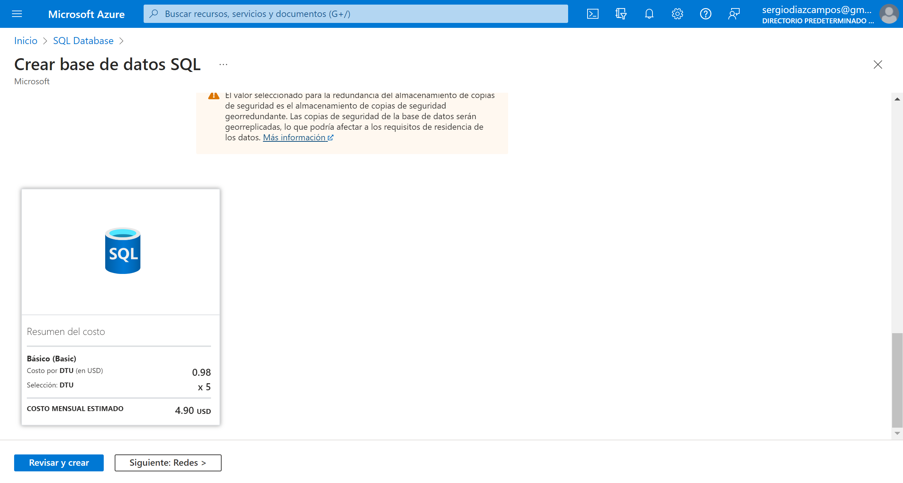

# eFoodDelivery Website - Trabajo de Fin de Grado

## 0.0 Crear el proyecto web API en Visual Studio 2022


## 0.1. Instalar los paquetes NuGets

- Microsoft.AspNetCore.Authentication.JwtBearer
- Microsoft.AspNetCore.Identity.EntityFrameworkCore
- Microsoft.EntityFrameworkCore.Tools
- Microsoft.EntityFrameworkCore.SqlServer
- Azure.Storage.Blobs

# 1. Conexión con BBDD

## 1.1. Conexión con SqlServer

### 1.1.1. Configurar la conexión con la BBDD

Para ello vamos al *appsettings.json* y añadimos nuestro *ConnectionStrings*

```json
"ConnectionStrings": {
    "SqlServerConnection": "Server=.;Database=eFoodDelivery-API;TrustServerCertificate=True;Trusted_Connection=True;"
  }
```

### 1.1.2. DbContexts --> SqlServerContext.cs

Creamos una nueva carpeta para albergar nuestros DbContexts, y creamos la clase de nuestra conexión a SqlServer

```csharp
public class SqlServerContext : IdentityDbContext
{
    public SqlServerContext(DbContextOptions options) : base(options)
    {
    }
}
```

### 1.1.3. Añadir el servicio de conexión al Program.cs

```csharp
// Add services to the container.
builder.Services.AddDbContext<SqlServerContext>(options =>
{
    options.UseSqlServer(builder.Configuration.GetConnectionString("SqlServerConnection"));
});

builder.Services.AddIdentity<IdentityUser, IdentityRole>().AddEntityFrameworkStores<SqlServerContext>();
```

### 1.1.4. Realizamos la primera migración a BBDD

Abrimos la consola de paquetes NuGets para ejecutar los siguientes comandos:

```bash
Add-Migration identity-migration-1 -Context SqlServerContext
```

Este comando nos genera dos archivos, y en el principal de ellos, EntityFramework nos ha creado un script sql para la creación de las tablas de Identity, las cuales engloban todo lo relacionado con la gestión de los usuarios de nuestra web, facilitándonos sobretodo el login, register y roles.

| AspNetRoleClaims |
--- |
| Id, RoleId, ClaimType, ClaimValue |

| AspNetRoles |
--- |
| Id, Name, NormalizedName, ConcurrencyStamp |

| AspNetUserClaims |
--- |
| Id, UserId, ClaimType, ClaimValue |

| AspNetUserLogins |
--- |
| LoginProvider, ProviderKey, ProviderDisplayName, UserId |

| AspNetUserRoles |
--- |
| UserId, RoleId |

| AspNetUserTokens |
--- |
| Id, LoginProvider, Name, Value |

| AspNetUsers |
--- |
| Id, UserName, NormalizedUserName, Email, NormalizedEmail, EmailConfirmed, PasswordHash, SecurityStamp, ConcurrencyStamp, PhoneNumber, PhoneNumberConfirmed, TwoFactorEnabled, LockoutEnd, LockoutEnabled, AccessFailedCount |

El segundo comando que vamos a ejecutar es para que EntityFramework nos cree la BBDD y sus correspondientes tablas en nuestro SqlServer

```bash
Update-Database -Context SqlSeerverContext
```


## 1.2. Conexión con AzureSQL

### 1.2.1. Crear el server y la BBDD

[crear la bbdd en azure](#crear-la-bbdd-en-azure)

### 1.2.2. Nueva cadena de conexión

Añadimos el string de la conexión alternativa a nuestra BBDD en Azure

```json
"ConnectionStrings": {
    // "SqlServerConnection": "Server=.;Database=eFoodDelivery-API;TrustServerCertificate=True;Trusted_Connection=True;",
    "AzureDbConnection": "Server=tcp:efooddelivery-db.database.windows.net,1433;Initial Catalog=eFoodDelivery-API;Persist Security Info=False;User ID=sqladmin;Password=YourPassword;MultipleActiveResultSets=False;Encrypt=True;TrustServerCertificate=False;Connection Timeout=30;"
  }
```

**Nota:** para migrar también a esta BBDD alternativa en Azure, comentamos en el *appsettings.json* la sentencia de conexión con SqlServer (sin olvidar cambiar el identificador de esta nueva conexión en el Program.cs).

### 1.2.3. ReMigramos las tablas de Identity

```bash
Update-Database -Context SqlSeerverContext
```


**Nota:** por el momento, mantendremos comentada la sentencia de la conexión alternativa a la BBDD de Azure, para continuar trabajando con la BBDD de SqlServer en local.

# Webgrafía y Enlaces de Interés

## [Introduction to Identity on ASP.NET Core](https://learn.microsoft.com/en-us/aspnet/core/security/authentication/identity?view=aspnetcore-7.0&tabs=visual-studio)

# Extras

## Crear la BBDD en Azure





## Crear el Azure Storage para nuestras imágenes


