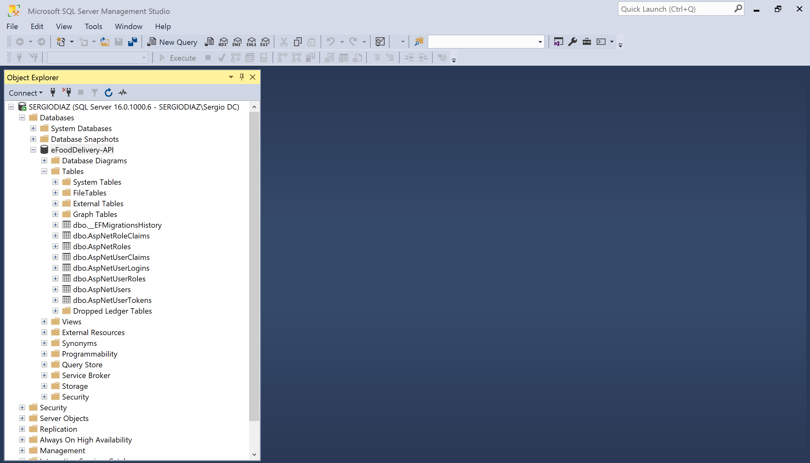
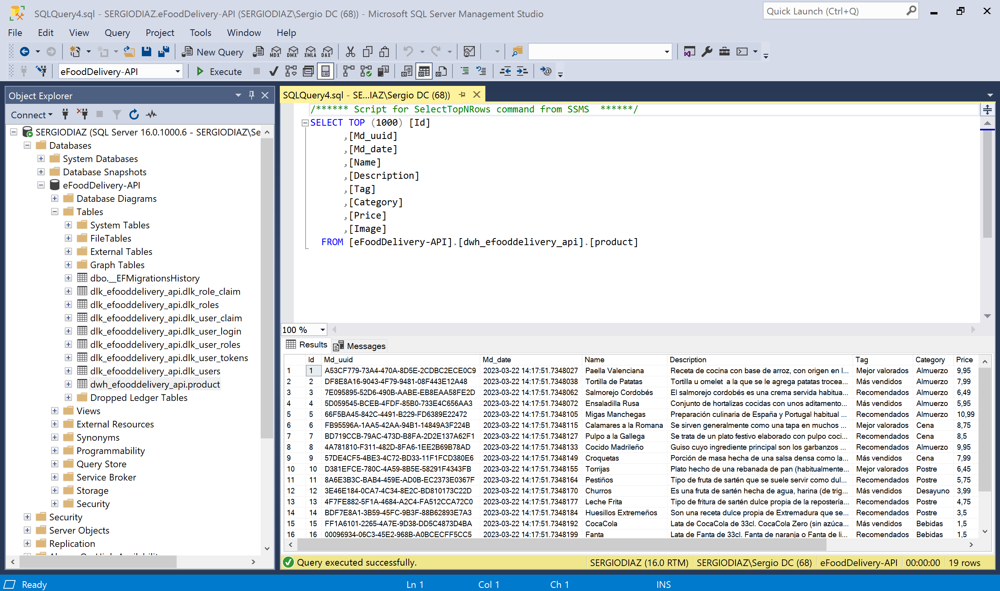

# eFoodDelivery Website - Trabajo de Fin de Grado

## 0.0 Crear el proyecto web API en Visual Studio 2022


## 0.1. Instalar los paquetes NuGets

- Microsoft.AspNetCore.Authentication.JwtBearer
- Microsoft.AspNetCore.Identity.EntityFrameworkCore
- Microsoft.EntityFrameworkCore.Tools
- Microsoft.EntityFrameworkCore.SqlServer
- Azure.Storage.Blobs

## 0.2. Ejecución inicial de prueba


# 1. Conexión con BBDD

## 1.1. Conexión con SqlServer

<!-- 
### 1.1.0. Diagrama Relacional Inicial de la BBDD

 
-->

### 1.1.1. Configurar la conexión con la BBDD

Para ello vamos al *appsettings.json* y añadimos nuestro *ConnectionStrings*

```json
"ConnectionStrings": {
    "SqlServerConnection": "Server=.;Database=eFoodDelivery-API;TrustServerCertificate=True;Trusted_Connection=True;"
  }
```

### 1.1.2. DbContexts --> ApplicationDbContext.cs

Creamos una nueva carpeta para albergar nuestros DbContexts, y creamos la clase de nuestra conexión a SqlServer

```csharp
public class ApplicationDbContext : IdentityDbContext
{
    public ApplicationDbContext(DbContextOptions options) : base(options)
    {
    }
}
```

### 1.1.3. Añadir el servicio de conexión al Program.cs

```csharp
// Add services to the container.
builder.Services.AddDbContext<ApplicationDbContext>(options =>
{
    options.UseSqlServer(builder.Configuration.GetConnectionString("SqlServerConnection"));
});

builder.Services.AddIdentity<IdentityUser, IdentityRole>().AddEntityFrameworkStores<ApplicationDbContext>();
```

### 1.1.4. Realizamos la primera migración a BBDD

Abrimos la consola de paquetes NuGets para ejecutar los siguientes comandos:

```bash
Add-Migration m1-identity -Context ApplicationDbContext
```

Este comando nos genera dos archivos, y en el principal de ellos, EntityFramework nos ha creado un script sql para la creación de las tablas de Identity, las cuales engloban todo lo relacionado con la gestión de los usuarios de nuestra web, facilitándonos sobretodo el login, register y roles.

| AspNetRoleClaims |
--- |
| Id, RoleId, ClaimType, ClaimValue |

| AspNetRoles |
--- |
| Id, Name, NormalizedName, ConcurrencyStamp |

| AspNetUserClaims |
--- |
| Id, UserId, ClaimType, ClaimValue |

| AspNetUserLogins |
--- |
| LoginProvider, ProviderKey, ProviderDisplayName, UserId |

| AspNetUserRoles |
--- |
| UserId, RoleId |

| AspNetUserTokens |
--- |
| Id, LoginProvider, Name, Value |

| AspNetUsers |
--- |
| Id, UserName, NormalizedUserName, Email, NormalizedEmail, EmailConfirmed, PasswordHash, SecurityStamp, ConcurrencyStamp, PhoneNumber, PhoneNumberConfirmed, TwoFactorEnabled, LockoutEnd, LockoutEnabled, AccessFailedCount |

El segundo comando que vamos a ejecutar es para que EntityFramework nos cree la BBDD y sus correspondientes tablas en nuestro SqlServer

```bash
Update-Database -Context ApplicationDbContext
```



## 1.2. Conexión con AzureSQL

### 1.2.1. Crear el server y la BBDD

[crear la bbdd en azure](#crear-la-bbdd-en-azure)

### 1.2.2. Nueva cadena de conexión

Añadimos el string de la conexión alternativa a nuestra BBDD en Azure

```json
"ConnectionStrings": {
    // "SqlServerConnection": "Server=.;Database=eFoodDelivery-API;TrustServerCertificate=True;Trusted_Connection=True;",
    "AzureDbConnection": "Server=tcp:efooddelivery-db.database.windows.net,1433;Initial Catalog=eFoodDelivery-API;Persist Security Info=False;User ID=sqladmin;Password=YourPassword;MultipleActiveResultSets=False;Encrypt=True;TrustServerCertificate=False;Connection Timeout=30;"
  }
```

**Nota:** para migrar también a esta BBDD alternativa en Azure, comentamos en el *appsettings.json* la sentencia de conexión con SqlServer (sin olvidar cambiar el identificador de esta nueva conexión en el Program.cs).

### 1.2.3. ReMigramos las tablas de Identity

```bash
Update-Database -Context ApplicationDbContext
```


**Nota:** por el momento, mantendremos comentada la sentencia de la conexión alternativa a la BBDD de Azure, para continuar trabajando con la BBDD de SqlServer en local.

## 1.3. Añadir campos a la tabla AspNetUsers y cambiar los nombres de las tablas

### 1.3.1. Models --> ApplicationUser.cs

Los campos que trae por defecto la tabla del usuario de Identity son limitados, y si queremos añadir más campos, como por ejemplo, un *username*, tenemos que crear nuestra propia clase de usuario la cual hereda de *IdentityUser*

```csharp
public class ApplicationUser : IdentityUser
{
    public string Name { get; set; }
}
```

### 1.3.2. Actualizar el Program.cs

```csharp
// Add Identity
builder.Services.AddIdentity<ApplicationUser, IdentityRole>().AddEntityFrameworkStores<ApplicationDbContext>();
```

### 1.3.3. DbContexts --> UserEntityConfiguration.cs

```csharp
public class UserEntityConfiguration : IEntityTypeConfiguration<ApplicationUser>
{
    public void Configure(EntityTypeBuilder<ApplicationUser> builder)
    {
        builder.Property(user => user.Name).HasMaxLength(20);
    }
}
```

### 1.3.4. DbContexts --> ApplicationDbContext.cs

Especificamos a EntityFramework la nueva clase del usuario

```csharp
public class ApplicationDbContext : IdentityDbContext<ApplicationUser>
{
    public ApplicationDbContext(DbContextOptions options) : base(options)
    {
    }

    public DbSet<ApplicationUser> ApplicationUsersDbSet { get; set; }

    protected override void OnModelCreating(ModelBuilder builder)
    {
        base.OnModelCreating(builder);
        builder.ApplyConfiguration(new UserEntityConfiguration());
        builder.HasDefaultSchema("dlk_efooddelivery_api");
    }
}
```

### 1.3.5. Nueva migración

Creamos una nueva migración y la pusheamos a nuestra BBDD local, y efectivamente comprobamos que ya tenemos el nuevo campos del *name* del usuario.


### 1.3.6. Cambiar los nombres por defecto de las tablas de Identity

[Cambiar los nombres por defecto de las tablas de Identity](#cambiar-los-nombres-por-defecto-de-las-tablas-de-identity)

```csharp
public class ApplicationDbContext : IdentityDbContext<ApplicationUser>
{
    ...
    // overrriding the OnModelCreating() method for customize our entities (tables)
    protected override void OnModelCreating(ModelBuilder builder)
    {
        ...
        builder.Entity<ApplicationUser>().ToTable("dlk_users");
        builder.Entity<IdentityRole>().ToTable("dlk_roles");
        builder.Entity<IdentityUserRole<string>>().ToTable("dlk_user_roles");
        builder.Entity<IdentityRoleClaim<string>>().ToTable("dlk_role_claim");
        builder.Entity<IdentityUserClaim<string>>().ToTable("dlk_user_claim");
        builder.Entity<IdentityUserLogin<string>>().ToTable("dlk_user_login");
        builder.Entity<IdentityUserToken<string>>().ToTable("dlk_user_tokens");
    }
}
```

## 1.4. Product entity

### 1.4.1. Entities --> Product.cs

Vamos a crear nuestra primera entidad, la del Producto.

```csharp
[Table("product", Schema = "dwh_efooddelivery_api")]
public class Product
{
    [Column("Md_uuid")]
    [Display(Name = "Md_uuid")]
    [DatabaseGenerated(DatabaseGeneratedOption.Identity)]
    public Guid Md_uuid { get; set; } = Guid.NewGuid();

    [Column("Md_date")]
    [Display(Name = "Md_date")]
    [DataType(DataType.DateTime)]
    [DisplayFormat(DataFormatString = "{0:dd-MM-yyyy}", ApplyFormatInEditMode = true)]
    public DateTime Md_date { get; set; } = DateTime.Now;

    [Key]
    [Column("Id")]
    [Display(Name = "Id")]
    [DatabaseGenerated(DatabaseGeneratedOption.Identity)]
    public int Id { get; set; }

    [Required]
    [Column("Name")]
    [Display(Name = "Name")]
    [StringLength(30, ErrorMessage = "El nombre del producto no puede exceder los 30 caracteres")]
    public string Name { get; set; }

    [Column("Description")]
    [Display(Name = "Description")]
    [StringLength(250, ErrorMessage = "La descripción del producto no puede exceder los 250 caracteres")]
    public string Description { get; set; }

    [Column("Tag")]
    [Display(Name = "Tag")]
    [StringLength(20, ErrorMessage = "La etiqueta del producto no puede exceder los 20 caracteres")]
    public string Tag { get; set; }

    [Column("Category")]
    [Display(Name = "Category")]
    [StringLength(20, ErrorMessage = "La categoría del producto no puede exceder los 20 caracteres")]
    public string Category { get; set; }

    [Column("Price")]
    [Display(Name = "Price")]
    [Range(1, 99, ErrorMessage = "El precio del producto no puede ser mayor a 99,00€")]
    public double Price { get; set; }

    [Required]
    [Column("Image")]
    [Display(Name = "Image")]
    public string Image { get; set; }
}
```

### 1.4.2. DbContexts --> sqlServerContext.cs

Añadimos el DbSet de la entiddad *Product*

```csharp
...
// navigation properties for entities (also it creates the tables)
public DbSet<ApplicationUser> ApplicationUsersDbSet { get; set; }
public DbSet<Product> ProductsDbSet { get; set; }
...
```

### 1.4.3. Creamos una nueva migración y pusheamos a la BBDD

```bash
Add-Migration m2-product -Context ApplicationDbContext
```

```bash
Update-Database -Context ApplicationDbContext
```


## 1.5 Añadir productos a la BBDD

Para poder testear bien las siguientes funcionalidades propias de un CRUD que desarrollaré en los siguientes apartados, necesito algunos productos de prueba y de base con los que empezar, y para ello usaré un objeto del tipo ModelBuilder en el contexto, para realizar algunos insert de productos en una nueva migración.

### 1.5.1. DbContexts --> ApplicationDbContext.cs

Siguiendo con el método del OnModelCreating(ModelBuilder) ...

```csharp
builder.Entity<Product>().HasData(
    // vamos añadiendo productos de ejemplo aquí
    new Product
    {
        Md_uuid = Guid.NewGuid(),
        Md_date = DateTime.Now,
        Id = 1,
        Name = "Paella Valenciana",
        Description = "Receta de cocina con base de arroz, con origen en la actual Comunidad Valenciana, hoy en día muy popular en toda España y servida en restaurantes de todo el mundo.​",
        Tag = "Mejor valorados",
        Category = "Almuerzo",
        Price = 9.95,
        Image = "https://efooddeliveryimages.blob.core.windows.net/efooddelivery-images/1.paella-nobg.png"
    },
    ...
);
```

### 1.5.2. Nueva migración y a la pushear a la BBDD

```bash
Add-Migration m3-sd-product -Context ApplicationDbContext
```

```bash
Update-Database -Context SqlSeerverContext
```



# 2. Controlador del producto

Creamos un controlador API para la entidad del Producto para desarrollar su CRUD.

## 2.1. GetProducts()

### 2.1.1. Models --> ApiResponse.cs

Necesitamos un modelo de lo que sería la respuesta de la petición get al servidor, la cual podremos controlar mejor si declaramos algunas propiedades para después utilizarlas en el controlador del producto.

```csharp
public class ApiResponse
{
    public HttpStatusCode StatusCode { get; set; } // eg: 404
    public bool Success { get; set; } // true or false
    public List<string> ErrorsList { get; set; } // eg: "there's no products avaible right now"
    public object Result { get; set; } // object fetched
    
    public ApiResponse() 
    {
        ErrorsList = new List<string>();
    }
}
```

## 2.1.2. ProductController.cs --> GetProducts()

```csharp
// [Route("api/[controller]")] // instead a dynamic route, if I change the controller name, the route does not get updated
[Route("api/Product")]
[ApiController]
public class ProductController : ControllerBase
{
    private readonly ApplicationDbContext _dbContext; // read property for our context
    private ApiResponse _apiResponse; // property for our API response

    public ProductController(ApplicationDbContext dbContext) // dependency injection
    {
        _dbContext = dbContext;
        _apiResponse = new ApiResponse();
    }

    [HttpGet]
    public async Task<IActionResult> GetProducts()
    {
        // return Ok(_dbContext.ProductsDbSet); // it will go to DB and fetch all products and return back, but I want to get better control for api response

        _apiResponse.Result = _dbContext.ProductsDbSet;
        _apiResponse.StatusCode = HttpStatusCode.OK;
        return Ok(_apiResponse);
    }
}
```

## 2.1.3. Prueba de ejecución

Ejecutamos el proyecto, y en Swagger, le damos al GET del endpoint de nuestro producto, y confirmamos que obtenemos todos los productos de prueba que previamente insertamos en la BBDD.

[Prueba de ejecución del método GetProducts()](#productcontrollercs----getproducts)

## 2.2. GetProduct(int id)

### 2.2.1. ProductController.cs --> GetProduct(int id)

```csharp
[HttpGet("{id:int}")] // like this method has a parameter, I need to specify what parameter is (name:type)
public async Task<IActionResult> GetProduct(int id)
{
    if (id == 0) // check for BadRequest
    {
        _apiResponse.StatusCode = HttpStatusCode.BadRequest;
        _apiResponse.Success = false;
        return BadRequest(_apiResponse);
    }
            
    Product product = _dbContext.ProductsDbSet.FirstOrDefault(p => p.Id == id);
            
    if(product == null) // check for NotFound
    {
        _apiResponse.StatusCode = HttpStatusCode.NotFound;
        _apiResponse.Success = false;
        return NotFound(_apiResponse);
    }

    _apiResponse.Result = product;
    _apiResponse.StatusCode = HttpStatusCode.OK;
    return Ok(_apiResponse);
}
```

## 2.2.2. Prueba de ejecución

[Prueba de ejecución del método GetProduct(int id)](#productcontrollercs----getproductint-id)

## 2.3. Gestión de imágenes

Antes de seguir con el CRUD del Producto (create, update y delete), necesitamos implementar el tratamiento de las imágenes de los productos.

**Nota:** aquí es donde voy a usar el paquete NuGet de Azure.Storage.Blob

### 2.3.1. Services --> Interfaces --> IBlobService.cs

```csharp
public interface IBlobService
{
    Task<string> GetBlob(string blobName, string containerName);

    Task<string> UploadBlob(string blobName, string containerName, IFormFile file);
        
    Task<bool> DeleteBlob(string blobName, string containerName);
}
```

### 2.3.2. Services --> Implementations --> BlobService.cs

```csharp
public class BlobService : IBlobService
{
    public Task<string> GetBlob(string blobName, string containerName)
    {
        throw new NotImplementedException();
    }

    public Task<string> UploadBlob(string blobName, string containerName, IFormFile file)
    {
        throw new NotImplementedException();
    }

    public Task<bool> DeleteBlob(string blobName, string containerName)
    {
        throw new NotImplementedException();
    }
}
```

### 2.3.3. appsettings.json

Aquí tenemos que añadir un nuevo string de conexión, el cual necesito sacarlo de AzureStorage donde ya había creado antes mi contenedor de imágenes y había subido las mismas.


```json
"ConnectionStrings": {
    ...
    "AzureImagesStorage": "TuCadenaDeConexión"
}
```

### 2.3.4. Añadir los servicios Blob en el Program.cs

```csharp
...
// activate Azure.Storage.Blobs nuget package
builder.Services.AddSingleton(blobService => // Singleton means there will only be one object when the application starts
    new BlobServiceClient(
        builder.Configuration.GetConnectionString("AzureImagesStorage")        
    )
);
builder.Services.AddSingleton<IBlobService, BlobService>();
...
```

### 2.3.5. Desarrollo de los métodos de implementación del BlobService

```csharp
public class BlobService : IBlobService
{
    private readonly BlobServiceClient _blobServiceClient;

    public BlobService(BlobServiceClient blobServiceClient)
    {
        _blobServiceClient = blobServiceClient;
    }

    public async Task<string> GetBlob(string blobName, string containerName)
    {
        // we have to get the container client, because in Azure we can have multiple containers for storage images
        BlobContainerClient blobContainerClient = _blobServiceClient.GetBlobContainerClient(containerName);
        // find blob (image) by blobName (imageName)
        BlobClient blobClient = blobContainerClient.GetBlobClient(blobName);

        // return full route for the blob (image)
        return blobClient.Uri.AbsoluteUri;
    }

    public async Task<string> UploadBlob(string blobName, string containerName, IFormFile file)
    {
        // we have to get the container client, because in Azure we can have multiple containers for storage images
        BlobContainerClient blobContainerClient = _blobServiceClient.GetBlobContainerClient(containerName);
        // find blob (image) by blobName (imageName)
        BlobClient blobClient = blobContainerClient.GetBlobClient(blobName);

        // we can also define blob HTTP header and set the content type
        var httpHeaders = new BlobHttpHeaders()
        {
            ContentType = file.ContentType
        };

        // upload the blob (image)
        var result = await blobClient.UploadAsync(file.OpenReadStream(), httpHeaders);

        if (result != null) // to get the blob updated
            return await GetBlob(blobName, containerName);

        // if (result == null)
            return "";
    }

    public async Task<bool> DeleteBlob(string blobName, string containerName)
    {
        // we have to get the container client, because in Azure we can have multiple containers for storage images
        BlobContainerClient blobContainerClient = _blobServiceClient.GetBlobContainerClient(containerName);
        // find blob (image) by blobName (imageName)
        BlobClient blobClient = blobContainerClient.GetBlobClient(blobName);

        return await blobClient.DeleteIfExistsAsync();
    }
}
```

## 2.4. CreateProduct([FromForm] ProductCreateDTO productCreateDTO)

### 2.4.1. DTOs --> ProductCreateDTO.cs

```csharp
public class ProductCreateDTO
{
    [Required]
    [StringLength(30, ErrorMessage = "El nombre del producto no puede exceder los 30 caracteres")]
    public string Name { get; set; }

    [StringLength(250, ErrorMessage = "La descripción del producto no puede exceder los 250 caracteres")]
    public string Description { get; set; }

    [StringLength(20, ErrorMessage = "La etiqueta del producto no puede exceder los 20 caracteres")]
    public string Tag { get; set; }

    [StringLength(20, ErrorMessage = "La categoría del producto no puede exceder los 20 caracteres")]
    public string Category { get; set; }

    [Range(1, 99, ErrorMessage = "El precio del producto no puede ser mayor a 99,00€")]
    public double Price { get; set; }

    public IFormFile Image { get; set; }
}
```

### 2.4.2. Tools --> Constants.cs

Como necesito declarar en alguna parte el nombre de mi contenedor de imágenes en Azure, voy a crear esta clase la cual me seguirá sirviendo para el restod e constantes que vaya necesitando declarar.

```csharp
public static class Constants
{
    public const string SD_STORAGE_CONTAINER = "efooddelivery-images";
}
```

### 2.4.3. ProductController.cs --> CreateProduct()

```csharp
[HttpPost]
public async Task<ActionResult<ApiResponse>> CreateProduct([FromForm] ProductCreateDTO productCreateDTO) // I'm not using [FromBody] and I'm using [FromForm] bacause we also need to upload an image when we creating a product
{
    try
    {
        if (ModelState.IsValid) // like we have some required fields, it will validate if all the endpoints are valid
        {
            if (productCreateDTO.Image == null || productCreateDTO.Image.Length == 0)
            {
                _apiResponse.StatusCode = HttpStatusCode.BadRequest;
                _apiResponse.Success = false;
                return BadRequest();
            }
                

            // get the imageName = name + .extension
            string imageName = $"{Guid.NewGuid()}{Path.GetExtension(productCreateDTO.Image.FileName)}";

            // create the new Product object through its dto
            Product productToCreate = new Product();
            productToCreate.Name = productCreateDTO.Name;
            productToCreate.Description = productCreateDTO.Description;
            productToCreate.Tag = productCreateDTO.Tag;
            productToCreate.Category = productCreateDTO.Category;
            productToCreate.Price = productCreateDTO.Price;
            productToCreate.Image = await _blobService.UploadBlob(imageName, Constants.SD_STORAGE_CONTAINER, productCreateDTO.Image); // upload the blob and it will return back the URL which we will save in the image
                    
            // save the object in DB
            _dbContext.ProductsDbSet.Add(productToCreate);
            _dbContext.SaveChanges();
            _apiResponse.Result = productToCreate;
            _apiResponse.StatusCode = HttpStatusCode.Created;
                    
            // return go to GetProduct() method to view the new product created
            return CreatedAtRoute("GetProduct", new { id = productToCreate.Id }, _apiResponse);
        }
        else
            _apiResponse.Success = false;

    } catch (Exception ex)
    {
        _apiResponse.Success = false;
        _apiResponse.ErrorsList = new List<string>() { ex.ToString() };
    }

    return _apiResponse;
}
```

### 2.4.5. Modificando la etiqueta de la cabecera del método GetProduct()

```csharp
[HttpGet("{id:int}", Name = "GetProduct")] // like this method has a parameter, I need to specify what parameter is (name:type) // also specify a Name for the action method in CreateProduct()
public async Task<IActionResult> GetProduct(int id) 
{
    ...
}
```

### 2.4.6. Prueba de ejecución

[Prueba de ejecución del método CreateProduct([FromForm] ProductCreateDTO productCreateDTO)](#productcontrollercs----createproductfromform-productcreatedto-productcreatedto)

## 2.5. UpdateProduct(int id, [FromForm] ProductUpdateDTO productUpdateDTO)

### 2.5.1. DTOs --> ProductUpdateDTO.cs

```csharp
public class ProductUpdateDTO
{
    [Key]
    public int Id { get; set; }

    [Required]
    [StringLength(30, ErrorMessage = "El nombre del producto no puede exceder los 30 caracteres")]
    public string Name { get; set; }

    [StringLength(250, ErrorMessage = "La descripción del producto no puede exceder los 250 caracteres")]
    public string Description { get; set; }

    [StringLength(20, ErrorMessage = "La etiqueta del producto no puede exceder los 20 caracteres")]
    public string Tag { get; set; }

    [StringLength(20, ErrorMessage = "La categoría del producto no puede exceder los 20 caracteres")]
    public string Category { get; set; }

    [Range(1, 99, ErrorMessage = "El precio del producto no puede ser mayor a 99,00€")]
    public double Price { get; set; }

    public IFormFile Image { get; set; }
}
```

### 2.5.2. ProductController.cs --> UpdateProduct()

```csharp
[HttpPut("{id:int}")]
public async Task<ActionResult<ApiResponse>> UpdateProduct(int id, [FromForm] ProductUpdateDTO productUpdateDTO) // I'm not using [FromBody] and I'm using [FromForm] bacause we also need to upload an image when we creating a product
{
    try
    {
        if (ModelState.IsValid) // like we have some required fields, it will validate if all the endpoints are valid
        {
            if (productUpdateDTO == null || id != productUpdateDTO.Id) return BadRequest();

            // Product productFetchedFromDb = await _dbContext.ProductsDbSet.FirstOrDefaultAsync(p => p.Id == id);
            Product productFetchedFromDb = await _dbContext.ProductsDbSet.FindAsync(id); // FindAsync() search by PK and in this case it works

            if (productFetchedFromDb == null) 
            {
                _apiResponse.StatusCode = HttpStatusCode.BadRequest;
                _apiResponse.Success = false;
                return BadRequest();
            }

            productFetchedFromDb.Name = productUpdateDTO.Name;
            productFetchedFromDb.Description = productUpdateDTO.Description;
            productFetchedFromDb.Tag = productUpdateDTO.Tag;
            productFetchedFromDb.Category = productUpdateDTO.Category;
            productFetchedFromDb.Price = productUpdateDTO.Price;

            if (productUpdateDTO.Image != null && productUpdateDTO.Image.Length > 0)
            {
                // get the imageName = name + .extension
                string imageName = $"{Guid.NewGuid()}{Path.GetExtension(productUpdateDTO.Image.FileName)}";

                // first, we need to delete the old image, and we have to get it with the URL after the second slash
                // https://efooddeliveryimages.blob.core.windows.net/efooddelivery-images/6622221b-7bf8-4204-9fb8-8e96d4e6490c.jpg  
                await _blobService.DeleteBlob(productFetchedFromDb.Image.Split('/').Last(), Constants.SD_STORAGE_CONTAINER);
                        
                // second, upload the new product
                productFetchedFromDb.Image = await _blobService.UploadBlob(imageName, Constants.SD_STORAGE_CONTAINER, productUpdateDTO.Image); // upload the blob and it will return back the URL which we will save in the image
            }

            // update the object in DB
            _dbContext.ProductsDbSet.Update(productFetchedFromDb);
            _dbContext.SaveChanges();
            _apiResponse.StatusCode = HttpStatusCode.NoContent;

            return Ok(_apiResponse);
        }
        else _apiResponse.Success = false;

    }
    catch (Exception ex)
    {
        _apiResponse.Success = false;
        _apiResponse.ErrorsList = new List<string>() { ex.ToString() };
    }

    return _apiResponse;
}
```

### 2.5.3. Prueba de Ejecución

[Prueba de ejecución del método UpdateProduct(int id, [FromForm] ProductUpdateDTO productUpdateDTO)](#productcontrollercs----updateproductint-id-fromform-productupdatedto-productupdatedto)

## 2.6. DeleteProduct(int id)

### 2.6.1. ProductController.cs --> DeleteProduct()

```csharp
[HttpDelete("{id:int}")]
public async Task<ActionResult<ApiResponse>> DeleteProduct(int id)
{
    try
    {
        if (id == 0) 
        {
            _apiResponse.StatusCode = HttpStatusCode.BadRequest;
            _apiResponse.Success = false;
            return BadRequest();
        }

        // Product productFetchedFromDb = await _dbContext.ProductsDbSet.FirstOrDefaultAsync(p => p.Id == id);
        Product productFetchedFromDb = await _dbContext.ProductsDbSet.FindAsync(id); // FindAsync() search by PK and in this case it works

        if (productFetchedFromDb == null) 
        {
            _apiResponse.StatusCode = HttpStatusCode.BadRequest;
            _apiResponse.Success = false;
            return BadRequest();
        }
        
        // first, we need to delete the old image, and we have to get it with the URL after the second slash
        // https://efooddeliveryimages.blob.core.windows.net/efooddelivery-images/6622221b-7bf8-4204-9fb8-8e96d4e6490c.jpg
        await _blobService.DeleteBlob(productFetchedFromDb.Image.Split('/').Last(), Constants.SD_STORAGE_CONTAINER);
                
        // remove the object in DB
        _dbContext.ProductsDbSet.Remove(productFetchedFromDb);
        _dbContext.SaveChanges();
        _apiResponse.StatusCode = HttpStatusCode.NoContent;

        return Ok(_apiResponse);

    }
    catch (Exception ex)
    {
        _apiResponse.Success = false;
        _apiResponse.ErrorsList = new List<string>() { ex.ToString() };
    }

    return _apiResponse;
}
```

### 2.6.2. Prueba de Ejecución

[Prueba de ejecución del método DeleteProduct(int id)](#productcontrollercs----deleteproductint-id)

# 3. Autentificación y Autorización

## 3.1. Login y Register DTOs

Vamos a comenzar por la creación de los DTOs para el Login. 
Crearemos un DTO para la petición del Login, y otro para la respuesta de éste.

### 3.1.1. DTOs --> LoginRequestDTO.cs

```csharp
public class LoginRequestDTO
{
    public string UserName { get; set; }
    public string Password { get; set; }
}
```

### 3.1.2. DTOs --> LoginResponseDTO.cs

```csharp
public class LoginResponseDTO
{
    public string Email { get; set; }
    public string Token { get; set; } // in this string Token we can add whatever details we want, like email, userID, userRole and more
}
```

### 3.1.3. DTOs --> RegisterRequestDTO.cs

```csharp
public class RegisterRequestDTO
{
    public string UserName { get; set; }
    public string Name { get; set; }
    public string Password { get; set; }
    public string Role { get; set; } 
    // if we want to create a user with admin role, we will expect that as a string when a user is registering
    // but I know role should not be in the registration in the production API
    // then, I will find out some other way to register the admin user like by seeding the database
}
```

En el caso del Register, no necesitamos otro modelo para la respuesta, porque si el resgitro tiene éxito, enviaremos un OK, y si falla, enviaremos un mensaje de error.

Tampoco tenemos que crear más tablas ahora porque ya tenemos todas las necesarias con la primera migracón que hice del Identity, el cual generó las tablas de usuarios, roles e intermedia entre éstos

### 3.1.4. Tools --> Constants.cs

También voy a dejar preparadas dos constantes que simbolicen los dos principales roles con lo que voy a trabajar.

```csharp
public static class Constants
{
    ...        
    public const string ROLE_ADMIN = "admin";
    public const string ROlE_CUSTOMER = "customer";
}
```

## 3.2. Controllers --> AuthenticationController.cs (Register)

### 3.2.1. Injección inicial de dependecias

```csharp
// [Route("api/[controller]")]
[Route("api/Authentication")]
[ApiController]
public class AuthenticationController : ControllerBase
{
    // dependencies to inject 
    private readonly ApplicationDbContext _dbContext;
    private ApiResponse _apiResponse;
    private string _JWTsecretKey;
    private readonly UserManager<ApplicationUser> _userManager; // Identity helper method
    private readonly RoleManager<IdentityRole> _roleManager;    // Identity helper methods

    public AuthenticationController(ApplicationDbContext dbContext, IConfiguration configuration, UserManager<ApplicationUser> userManager, RoleManager<IdentityRole> roleManager) // using this configuration, we can access to appsettings.json
    {
        _dbContext = dbContext;
        _apiResponse = new ApiResponse();
        _JWTsecretKey = configuration.GetValue<string>("ApiSecrets:JWTsecret"); //  and we can populate the JWTsecretKey by this way
        _userManager = userManager;
        _roleManager = roleManager;
    }
}
```

### 3.2.2. appsettings.json --> JWTsecret

```json
"ApiSecrets": {
  "JWTsecret": "myJWTsecret" // aún no voy a implementar esto pero sí lo dejo preparado
}
```

### 3.2.3. AuthenticationController.cs --> Register([FromBody] RegisterRequestDTO registerRequestDTO)

```csharp
[HttpPost("Register")]
public async Task<IActionResult> Register([FromBody] RegisterRequestDTO registerRequestDTO)
{
    // check if the new user alredy exists
    ApplicationUser userFetchedFromDb = _dbContext.ApplicationUsersDbSet.FirstOrDefault(user => user.UserName.ToLower() == registerRequestDTO.UserName.ToLower());

    // if the user alredy exists --> Error message and BadRequest
    if (userFetchedFromDb != null)
    {
        _apiResponse.StatusCode = HttpStatusCode.BadRequest;
        _apiResponse.Success = false;
        _apiResponse.ErrorsList.Add("UserName alredy exists");

        return BadRequest(_apiResponse);
    }

    // if the user not exists yet --> create the new user
    ApplicationUser newUser = new ApplicationUser();
    newUser.UserName = registerRequestDTO.UserName;
    newUser.Email = registerRequestDTO.UserName; // by the moment, we will keep the email as the UserName
    newUser.NormalizedEmail = registerRequestDTO.UserName.ToUpper();
    newUser.Name = registerRequestDTO.Name;

    try
    {
        // to insert the new user in db we use _userManager
        var result = await _userManager.CreateAsync(newUser, registerRequestDTO.Password);

        // now it's time to assign a role to the new user
        if (result.Succeeded)
        {
            // if the role we want to create doesn't exists yet
            if (!_roleManager.RoleExistsAsync(Constants.ROLE_ADMIN).GetAwaiter().GetResult()) // like we can't use await in conditions, we have to use the method GetAwaiter()
            {
                // create roles in db
                await _roleManager.CreateAsync(new IdentityRole(Constants.ROLE_ADMIN));
                await _roleManager.CreateAsync(new IdentityRole(Constants.ROlE_CUSTOMER));
            }

            // once roles are created in db we need to assign a role to this particular new user
            if (registerRequestDTO.Role.ToLower() == Constants.ROLE_ADMIN)
                await _userManager.AddToRoleAsync(newUser, Constants.ROLE_ADMIN);
            else
                await _userManager.AddToRoleAsync(newUser, Constants.ROlE_CUSTOMER);

            _apiResponse.StatusCode = HttpStatusCode.OK;
            _apiResponse.Success = true;

            return Ok(_apiResponse);
        }
    }
    catch (Exception ex)
    {

    }

    _apiResponse.StatusCode = HttpStatusCode.BadRequest;
    _apiResponse.Success = false;
    _apiResponse.ErrorsList.Add("Error occurred during registration");

    return BadRequest(_apiResponse);
}
```

### 3.2.4. Desactivar en el Program.cs durante el desarrollo del proyecto las comprobaciones de Identity en el registro

```csharp
...
// to turn off the default configuration for Identity in Register // only for development
builder.Services.Configure<IdentityOptions>(options =>
{
    options.Password.RequireDigit = false;
    options.Password.RequiredLength = 1;
    options.Password.RequireLowercase = false;
    options.Password.RequireUppercase = false;
    options.Password.RequireNonAlphanumeric = false;
});
...
```

### 3.2.5. Prueba de Ejecución

[Prueba de ejecución del método Register([FromBody] RegisterRequestDTO registerRequestDTO)](#authenticationcontrollercs----registerfrombody-registerrequestdto-registerrequestdto)

## 3.3. Login with JWT

### 3.3.1. AuthenticationController.cs --> Login()

```csharp
// dependencies to inject 
private readonly ApplicationDbContext _dbContext;private ApiResponse _apiResponse;
private string _JWTsecretKey;
private readonly UserManager<ApplicationUser> _userManager; // Identity helper method
private readonly RoleManager<IdentityRole> _roleManager;    // Identity helper methods

public AuthenticationController(ApplicationDbContext dbContext, IConfiguration configuration, UserManager<ApplicationUser> userManager, RoleManager<IdentityRole> roleManager) // using this configuration, we can access to appsettings.json
{
    _dbContext = dbContext;
    _apiResponse = new ApiResponse();
    _JWTsecretKey = configuration.GetValue<string>("ApiSecrets:JWTsecret"); //  and we can populate the JWTsecretKey by this way
    _userManager = userManager;
    _roleManager = roleManager;
}

[HttpPost("Login")]
public async Task<IActionResult> Login([FromBody] LoginRequestDTO loginRequestDTO)
{
    // when the user tries to login in base his username, we have to retrieve that user from db
    ApplicationUser userFetchedFromDb = _dbContext.ApplicationUsersDbSet.FirstOrDefault(user => user.UserName.ToLower() == loginRequestDTO.UserName.ToLower());

    // we can use a Identity Helper Method to check the password
    bool valid = await _userManager.CheckPasswordAsync(userFetchedFromDb, loginRequestDTO.Password);

    // if password given by user doesn't match with password in db --> BadRequest
    if (!valid)
    {
        _apiResponse.Result = new LoginResponseDTO();
        _apiResponse.StatusCode = HttpStatusCode.BadRequest;
        _apiResponse.Success = false;
        _apiResponse.ErrorsList.Add("Username or Password is incorrect");

        return BadRequest(_apiResponse);
    }
    
    ////////////////////////////////////// Token Generation starts ///////////////////////////////////////
    // if the password match correctly, we have to generate a JWT
    JwtSecurityTokenHandler jwtSecurityTokenHandler = new JwtSecurityTokenHandler();
    // we have to convert in array our _JWTsecretKey
    byte[] secretKey = Encoding.ASCII.GetBytes(_JWTsecretKey);
    // we will need the user role so let's get it with an Identity helper method
    var userRoles = await _userManager.GetRolesAsync(userFetchedFromDb);
    // to define properties for the token
    SecurityTokenDescriptor securityTokenDescriptor = new SecurityTokenDescriptor();
    // each one of those properties are defined in a Claim inside a claim array (creating an object of ClaimsIdentity type)
    securityTokenDescriptor.Subject = new ClaimsIdentity(new Claim[]
        {
            new Claim("fullName", userFetchedFromDb.Name),
            new Claim("userId", userFetchedFromDb.Id.ToString()),
            // there are some claims alredy defined inside ClaimTypes class
            new Claim(ClaimTypes.Email, userFetchedFromDb.UserName.ToString()),
            new Claim(ClaimTypes.Role, userRoles.FirstOrDefault()),
        });
    // how long the token is valid for ??
    securityTokenDescriptor.Expires = DateTime.UtcNow.AddDays(7);
    // we need to use our byte[]secretKey to validate or add a signature to our token
    securityTokenDescriptor.SigningCredentials = new SigningCredentials
        (
            new SymmetricSecurityKey(secretKey), 
            SecurityAlgorithms.HmacSha256Signature
        );
    // Final step --> generate token
    SecurityToken securityToken = jwtSecurityTokenHandler.CreateToken(securityTokenDescriptor);
    ////////////////////////////////////// Token Generation ends ///////////////////////////////////////

    // populate email and token
    LoginResponseDTO loginResponseDTO = new LoginResponseDTO();
    loginResponseDTO.Email = userFetchedFromDb.Email;
    loginResponseDTO.Token = jwtSecurityTokenHandler.WriteToken(securityToken);

    // if the email is null, return again a BadRequest
    if (loginResponseDTO.Email == null || string.IsNullOrEmpty(loginResponseDTO.Token))
    {
        _apiResponse.StatusCode = HttpStatusCode.BadRequest;
        _apiResponse.Success = false;
        _apiResponse.ErrorsList.Add("Username or Password is incorrect");

        return BadRequest(_apiResponse);
    }

    // if everything is valid like email and token are populated, then we will return back OK
    _apiResponse.StatusCode = HttpStatusCode.OK;
    _apiResponse.Success = true;
    _apiResponse.Result = loginResponseDTO;

    return Ok(_apiResponse);
}
```

### 3.3.2. appsettings.json --> JWT string secret

```json
"ApiSecrets": {
    "JWTsecret": "1983y180dhwqbxc1982y83y7reyt6frcuy2bdo1n3d7y28dg91eohxcs1hx3w89dh7undon283hd3deb" 
    // base string to generate token with JWT // it could be whatever you want (I pressed keys randomly)
}
```

### 3.3.3. Prueba de Ejecución

[Prueba de ejecución del método Login([FromBody] LoginRequestDTO loginRequestDTO)](#authenticationcontrollercs----loginfrombody-loginrequestdto-loginrequestdto)

## 3.4. Usar el JWT para la Autentificación y la Autorización del usuario

Para testear en Swagger esto, voy a hacer un controlador API aparte con dos métodos [HttpGet] muy simples para la autentificación y la autorización.

### 3.4.1. AuthenticationTestController.cs --> GetAuthentication()

```csharp
[HttpGet]
[Authorize] // if we want to get some endpoint to be accessed by only authenticated users, we have to add this tag
public async Task<ActionResult<string>> GetAuthentication()
{
    // Authentication means that if my username and password is valid, I'm authenticated
    return "You're authenticated successfully";
}
```

### 3.4.2. AuthenticationTestController.cs --> GetAuthorization(int id)

```csharp
[HttpGet("{id:int}")]
[Authorize(Roles = Constants.ROLE_ADMIN)] // if we want that some endpoint needs to be accessed only with an admin role, we have to specify the rol
public async Task<ActionResult<string>> GetAuthorization(int id)
{
    // Authorization means the role we get when we login and what we're able to go and do
    return "You're authorized with admin role";
}
```

### 3.4.3. Configurar la Autentificación en el Program.cs

Si bien es cierto que la Autorización ya viene habilitada por defecto, la autentificación no.
Recordamos que la Autorización = Autentificación + accesos(roles).

```csharp
app.UseAuthentication(); // adding authentication we can get its endpoint in swagger
app.UseAuthorization();  // it was here by default
```

Pero con esto, aún no sería suficiente, ya que si incurrimos en un error de autentificación, la respuesta por defecto nos devolverá un estado 404, el cual es NotFound y no se correspondería con lo que realmente estaría sucediendo.
Para que nuestro proyecto entienda bien la autentificación del usuario, es necesario realizar unas configuraciones en el Program.cs

En la parte de los servicios ...

```csharp
...
builder.Services.AddIdentity<ApplicationUser, IdentityRole>().AddEntityFrameworkStores<ApplicationDbContext>();

// to turn off the default configuration for Identity in Register // only for development
builder.Services.Configure<IdentityOptions>(options =>
{
    options.Password.RequireDigit = false;
    options.Password.RequiredLength = 1;
    options.Password.RequireLowercase = false;
    options.Password.RequireUppercase = false;
    options.Password.RequireNonAlphanumeric = false;
});

// how to decode the JWT?? We'll use the key we are storing inside the appsettings.json
var JWTsecretKey = builder.Configuration.GetValue<string>("ApiSecrets:JWTsecret"); // retrieve the key like we did in Login() method
// once we have that key inside the JWT bearer, we have to write the token validation parameters
TokenValidationParameters tokenValidationParameters = new TokenValidationParameters();
tokenValidationParameters.ValidateIssuerSigningKey = true;
tokenValidationParameters.IssuerSigningKey = new SymmetricSecurityKey(Encoding.ASCII.GetBytes(JWTsecretKey));
// now I'm working locally but when I deploy the project, I'll have a certain audience like only this URL can send the token
tokenValidationParameters.ValidateIssuer = false;
tokenValidationParameters.ValidateAudience = false;

builder.Services.AddAuthentication(options =>
    {
        options.DefaultAuthenticateScheme = JwtBearerDefaults.AuthenticationScheme; // just a constant value of bearer
        options.DefaultChallengeScheme = JwtBearerDefaults.AuthenticationScheme; // we'll also have the same default challenge scheme on that
    }
).AddJwtBearer(options => // we have to add the JWT bearer as well and we have to configure on what we allow with JWT bearer
    {
        options.RequireHttpsMetadata = false;
        options.SaveToken = true;
        options.TokenValidationParameters = tokenValidationParameters;
    }
);

builder.Services.AddCors(); // if an API is being called from some other URL, it will work
...
```

En la parte del pipeline

```csharp
...
app.UseCors(options => // when we have to add cors, also inside the request pipeline, we have to use cors
{
    options
        .AllowAnyHeader()
        .AllowAnyMethod()
        .AllowAnyOrigin()
    ;
});

app.UseAuthentication(); // adding authentication we can get its endpoint in swagger
app.UseAuthorization();  // it was here by default
...
```

Una vez configurado todo esto, si ejecutamos la API y vamos a nuestro método de testeo del *GetAuthentication()*, podremos comprobar que ante un fallo de autentificación, en vez de obtener el error confuso del 404 NotFound, ahora obtendremos el error específico del 401 Unathorize


## 3.5. Añadiendo seguridad a Swagger

Continuando con el test del endpoint de la autentificación, llegamos a obtener el error específico del 401.

Pero para acceder al recurso en sí de la respuesta (autentificarnos exitósamente y que nos salga el mensaje), necesitamos pasar el JWT.

Pero no podemos pasar el token a través de la documentación de Swagger, actualmente no tenemos ninguna forma de pasarlo.

Vamos a añadir una serie de configuraciones al final de la sección de servicios del Program.cs para poder hacer esto.

**Nota:** la idea básica es que, utilizando un token podamos acceder al endpoint adjunto al rol de tal token. (recuerda que el token del admin es diferente al token del customer, lo cual implica un rol diferente, y por tanto, un acceso y restricciones diferentes).

```csharp
OpenApiSecurityScheme openApiSecurityScheme1 = new OpenApiSecurityScheme();
openApiSecurityScheme1.Description = // add some text here where we will say that enter better space and then your token in the input field
    "JWT Authorization header using the Bearer scheme. \r\n\r\n " +
    "Enter 'Bearer' [space] and then your token in the text input below.\r\n\r\n" +
    "Example: \"Bearer 12345abcdef\"";
openApiSecurityScheme1.Name = "Authorization";
openApiSecurityScheme1.In = ParameterLocation.Header; // we have to define where we will add this and that will be inside 
openApiSecurityScheme1.Scheme = JwtBearerDefaults.AuthenticationScheme; // "Bearer"

OpenApiReference openApiReference = new OpenApiReference();
openApiReference.Type = ReferenceType.SecurityScheme;
openApiReference.Id = "Bearer";

OpenApiSecurityScheme openApiSecurityScheme2 = new OpenApiSecurityScheme();
openApiSecurityScheme2.Reference = openApiReference;
openApiSecurityScheme2.Scheme = "oauth2";
openApiSecurityScheme2.Name = "Bearer";
openApiSecurityScheme2.In = ParameterLocation.Header;

builder.Services.AddSwaggerGen(options => // here we can configure options on SwaggerGen and define that for the security definition we want to use bearer token.
{
    options.AddSecurityDefinition(
        JwtBearerDefaults.AuthenticationScheme, // --> "Bearer"
        openApiSecurityScheme1
    );

    options.AddSecurityRequirement(new OpenApiSecurityRequirement()
    {
        {
            openApiSecurityScheme2,
            new List<string>()
        }
    });
});
```

Una vez hecho esto, si ejecutamos ahora el proyecto, veremos un icono de un candado en cada endpoint y un botón en la parte superior derecha que dice "Authorize".

Voy a aclarar mejor toda esta funcionalidad de soporte extra de Swagger con un video a modo de prueba de ejecución.

[Prueba de Ejecución 1 - Añadiendo soporte extra de seguridad a Swagger](https://user-images.githubusercontent.com/80839621/227771181-978f91a7-933b-4753-9be1-08b3fac3ba9e.mp4)

En el video se puede apreciar que, tras pulsar el botón de "Authorize" nos sale encima del input el texto de descripción que configuramos previamente en el *openApiSecurityScheme1*, y en el input se espera que introduzcamos el *Bearer Token*.

Primero pruebo a introducir una cosa cualquiera falsa, y efectivamente cuando ejecuto el endpoint de testeo de la autentificación, me salta el error 401.

Pero si hago login como administrador, y cojo el token de éste, pongo en el input del botón Authorize, "Bearer [copia/pega del token]", y volvemos a ejecutar el endpoint de testeo de la autentificación, comprobamos que ya nos devuelve el estado de éxito y el mensaje de que nos hemos autentificado correctamente.

**Nota:** recordando que en el endpoint de testeo de la autentificación que recibe un id, pusimos la etiqueta authorize solo para que accediera el admin... si hacemos la prueba de logearnos como un customer y copiamos su token y hacemos la prueba de tal endpoint, veremos que nos salta un error de 403 de prohibido... pero en cambio, si lo probamos con el token del admin, nos devolverá el estado de éxito con el mensaje de prueba.

[Prueba de Ejecución 2 - Seguridad Swagger - Testeando el endpoint de la autentificación para el rol admin](https://user-images.githubusercontent.com/80839621/227773208-afdf57f5-bfaf-4fc6-a845-892d133a57b7.mp4)

# Webgrafía y Enlaces de Interés

### 1. [Introduction to Identity on ASP.NET Core](https://learn.microsoft.com/en-us/aspnet/core/security/authentication/identity?view=aspnetcore-7.0&tabs=visual-studio)

### 2. [How can I change the table names when using ASP.NET Identity?](https://stackoverflow.com/questions/19460386/how-can-i-change-the-table-names-when-using-asp-net-identity)

### 3. [Wrapping ASP.NET Web API Responses for consistency and to provide additional information](https://www.devtrends.co.uk/blog/wrapping-asp.net-web-api-responses-for-consistency-and-to-provide-additional-information)

### 4. [How to make your Web API responses consistent and useful](https://www.infoworld.com/article/3674115/how-to-make-your-web-api-responses-consistent-and-useful.html)

### 5. [How to use Azure Blob Storage in an ASP.NET Core Web API to list, upload, download, and delete files](https://blog.christian-schou.dk/how-to-use-azure-blob-storage-with-asp-net-core/)

### 6. [Almacenamiento de archivos mediante un API en .NET y Azure Blob Storage](https://www.youtube.com/watch?v=wrAGiywdOjE&ab_channel=CristopherCoronado)

### 7. [Web API in .NET 6.0 Tutorial: How to Build CRUD Operation](https://www.bacancytechnology.com/blog/web-api-in-net-6)

### 8. [.NET 7 Web API & Entity Framework 🚀 Full Course (CRUD, Repository Pattern, DI, SQL Server & more)](https://www.youtube.com/watch?v=8pH5Lv4d5-g&ab_channel=PatrickGod)

### 9. [.NET 7 Web API 🔒 Create JSON Web Tokens (JWT) - User Registration / Login /](https://www.youtube.com/watch?v=UwruwHl3BlU&ab_channel=PatrickGod)

### 10. [.NET 7 Web API 🔒 Role-Based Authorization with JSON Web Tokens (JWT) & the dotnet user-jwts CLI](https://www.youtube.com/watch?v=6sMPvucWNRE&ab_channel=PatrickGod)

### 11. [Swagger Documentation --> Bearer Authentication](https://swagger.io/docs/specification/authentication/bearer-authentication/#:~:text=The%20bearer%20token%20is%20a,Authorization%3A%20Bearer)

### 12. [How To Add JWT Authentication To An ASP.NET Core API](https://medium.com/geekculture/how-to-add-jwt-authentication-to-an-asp-net-core-api-84e469e9f019)

### 13. [How to Implement JWT Authentication in Asp.Net Core Web API](https://labpys.com/how-to-implement-jwt-authentication-in-asp-net-core-web-api/)

# Pruebas de Ejecución

## ProductController.cs --> GetProducts()


## ProductController.cs --> GetProduct(int id)


## ProductController.cs --> CreateProduct([FromForm] ProductCreateDTO productCreateDTO)


## ProductController.cs --> UpdateProduct(int id, [FromForm] ProductUpdateDTO productUpdateDTO)


## ProductController.cs --> DeleteProduct(int id)


## AuthenticationController.cs --> Register([FromBody] RegisterRequestDTO registerRequestDTO)


## AuthenticationController.cs --> Login([FromBody] LoginRequestDTO loginRequestDTO)


# Extras

## 1. Crear la BBDD en Azure


## 2. Crear el Azure Storage para nuestras imágenes


## 3. Cambiar los nombres por defecto de las tablas de Identity

### DbContexts --> UserEntityConfiguration.cs

```csharp
public class UserEntityConfiguration : IEntityTypeConfiguration<ApplicationUser>
{
    public void Configure(EntityTypeBuilder<ApplicationUser> builder)
    {
        builder.Property(user => user.Name).HasMaxLength(20);
    }
}
```

### DbContexts --> ApplicationDbContext.cs

```csharp
// overrriding the OnModelCreating() method for customize our entities (tables)
protected override void OnModelCreating(ModelBuilder builder)
{
    base.OnModelCreating(builder);
    builder.ApplyConfiguration(new UserEntityConfiguration());
    builder.HasDefaultSchema("dlk_efooddelivery_api");

    builder.Entity<ApplicationUser>().ToTable("dlk_users");
    builder.Entity<IdentityRole>().ToTable("dlk_roles");
    builder.Entity<IdentityUserRole<string>>().ToTable("dlk_user_roles");
    builder.Entity<IdentityRoleClaim<string>>().ToTable("dlk_role_claim");
    builder.Entity<IdentityUserClaim<string>>().ToTable("dlk_user_claim");
    builder.Entity<IdentityUserLogin<string>>().ToTable("dlk_user_login");
    builder.Entity<IdentityUserToken<string>>().ToTable("dlk_user_tokens");
}
```

### Creamos una nueva migración y la pusheamos a la BBDD

```bash
Add-Migration m1-identity -Context ApplicationDbContext
```

```bash
Update-Database -Context ApplicationDbContext
```

